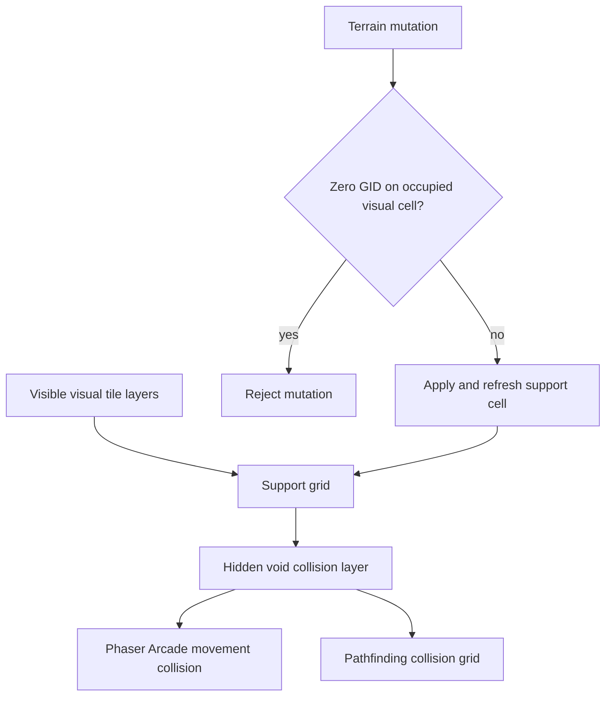

# fix: Keep avatars on supported map tiles

## Goal Capsule

- **Objective:** Make cells without a visible visual tile non-walkable by default and prevent terrain deletion from removing a tile beneath any local or remote avatar currently present in the room.
- **Authority:** The user's request and screenshot define the behavior; existing Phaser collision and floor-editor mutation boundaries define the implementation shape.
- **Execution profile:** Extend the current synthetic collision-layer and terrain-mutation patterns without changing map schemas, storage formats, or unrelated editor behavior.
- **Stop conditions:** Do not broaden this into map repair, avatar repositioning, or a new authoring preference. Preserve all existing worktree changes.
- **Tail ownership:** Focused Vitest coverage, play typechecking, lint/format checks, and a browser smoke test own completion.

---

## Product Contract

### Summary

Avatars may only move into cells backed by a visible, nonzero tile in a visual tile layer; avatars already in unsupported legacy space are not repositioned. Empty map space behaves like a collision boundary. Floor edits may replace a tile beneath an avatar, but may not clear it while any room avatar occupies the cell.

### Problem Frame

The map currently treats cells with no terrain tile as walkable unless a collision tile explicitly blocks them, allowing avatars to leave authored floor geometry and stand in the map void. The live floor editor can then clear a tile beneath a local or remote avatar, creating the same unsupported state after movement has already occurred.

### Requirements

- R1. Direct keyboard, follow, and pathfinding movement cannot enter a cell that has no visible, nonzero tile in a visual map layer.
- R2. Collision-storage layers, start/exit markers, synthetic runtime collision layers, hidden layers, and zero GIDs do not count as avatar-supporting floor.
- R3. The support boundary updates immediately after live tile painting, replacement, erasure, layer-visibility changes, and map-geometry synchronization.
- R4. A zero-GID terrain mutation that targets a cell occupied by any room avatar is rejected authoritatively before persistence, with client-side preflight for the current avatar and visible remote avatars.
- R5. A nonzero replacement at an occupied cell remains allowed.
- R6. Erasure of an unoccupied tile remains allowed, and collision/start/exit marker editing retains its existing semantics.

### Acceptance Examples

- AE1. Given an avatar stands beside authored floor, when it moves toward an adjacent cell containing no visible visual tile, then Phaser collision and pathfinding both treat that cell as blocked.
- AE2. Given any room avatar occupies a floor cell, when the floor editor, scripting API, undo/redo, or incoming terrain command attempts to write GID zero to that visual cell, then the mutation is rejected and the tile remains.
- AE3. Given an avatar occupies a floor cell, when the editor replaces that tile with another nonzero tile, then the replacement succeeds and movement support remains.
- AE4. Given an unoccupied floor cell, when the editor erases its last supporting visual tile, then the cell becomes blocked immediately.

### Scope Boundaries

- No automatic teleport or repair for avatars already positioned in unsupported space when a legacy map loads.
- No new map property, editor toggle, or persistence schema.
- No change to entity/area collision behavior or marker-layer erasure.
- No new persistent occupancy registry; authoritative validation uses the room server's existing live user positions.

---

## Planning Contract

### Key Technical Decisions

- KTD1. **Use a hidden synthetic void-collision layer.** `GameScene` already attaches Arcade colliders to every runtime Phaser tile layer; a dedicated layer therefore constrains direct movement and can also participate in the existing collision grid used by pathfinding.
- KTD2. **Derive support from visible visual tile layers.** A cell is supported when at least one eligible visible layer has a nonzero GID. Collision storage, authoring path overlays, and synthetic runtime layers are excluded so metadata cannot manufacture floor.
- KTD3. **Merge void support after authoring collision overrides.** The void layer is dynamic collision state, ensuring an empty authoring-collision cell cannot make unsupported space walkable.
- KTD4. **Use defense-in-depth deletion validation.** Floor-editor preview and the low-level scripting tile-write path provide immediate client protection, while `GameRoom` validates every persisted terrain mutation against its live room-wide user positions before map storage accepts it. Replacement remains valid because only zero-GID writes are rejected.
- KTD5. **Preserve optimistic and history state on late rejection.** If occupancy changes after preview but before execution, rejection restores the inverse preview and leaves the undo/redo cursor, map revision, persistence state, and current tile state unchanged.

### High-Level Technical Design

### Assumptions

- Avatar coordinates map to the supporting foot cell containing the character's Phaser/server position, using current map tile size and grid origin on both client and room server.
- A hidden layer does not provide usable floor because it is not currently part of the rendered world.
- Rejecting the whole mutation when any region would delete an occupied tile is safer and preserves atomic command/undo behavior.

### Sequencing

Implement the pure support and occupied-deletion rules first, integrate the synthetic collision layer second, then apply the mutation guard and command-level proof.

---

## Implementation Units

### U1. Define tile-support and occupied-erasure rules

- **Goal:** Centralize pure rules for determining supported cells and detecting forbidden zero-GID writes.
- **Requirements:** R2, R4-R6; AE2-AE3.
- **Dependencies:** None.
- **Files:** `play/src/front/Phaser/Game/GameMap/AuthoringCollision.ts`, `play/tests/front/Phaser/Game/GameMap/AuthoringCollision.test.ts`.
- **Approach:** Add support-grid derivation over visible, eligible visual tile layers and a mutation predicate that ignores marker/collision storage edits, rejects zero-GID writes at occupied coordinates, and accepts nonzero replacement.
- **Patterns to follow:** Existing layer flattening, GID iteration, collision-layer classification, and pure Vitest fixtures in `AuthoringCollision.ts` and its test.
- **Test scenarios:** Visible nonzero tiles mark support; zero GIDs do not; hidden, collision-storage, start, and exit layers do not provide support; another eligible layer can support the same cell; occupied visual deletion is detected; occupied replacement, marker erasure, and unoccupied erasure are accepted.
- **Verification:** Pure helper tests establish deterministic support and deletion semantics without Phaser mocks.

### U2. Enforce void collision for movement and pathfinding

- **Goal:** Materialize unsupported cells as collision state for every avatar movement mode.
- **Requirements:** R1-R3; AE1, AE4.
- **Dependencies:** U1.
- **Files:** `play/src/front/Phaser/Game/GameMap/GameMapFrontWrapper.ts`, `play/tests/front/Phaser/Game/GameMap/AuthoringCollision.test.ts`, `play/tests/front/Phaser/Game/MapEditor/FloorEditorRendering.test.ts`.
- **Approach:** Create an invisible synthetic void-collision layer beside the existing entity and area layers, populate it from the support grid, classify it as dynamic collision for collision-grid composition, and refresh affected cells after tile writes plus the complete layer after visibility or geometry changes.
- **Patterns to follow:** `__entitiesCollisionLayer`, `__areasCollisionLayer`, `modifyToCollisionsLayer`, collision-grid invalidation, and geometry synchronization in `GameMapFrontWrapper.ts`.
- **Test scenarios:** Unsupported cells become dynamic colliders after authoring collision composition; supported cells remain walkable unless another collision applies; a tile delete flips support to blocked; a nonzero paint flips it back to supported; hiding the last supporting layer blocks the cell; source checks confirm the synthetic layer participates in Phaser colliders and refresh paths.
- **Verification:** Focused tests prove the grid transitions and integration wiring used by direct movement and pathfinding.

### U3. Reject erasure beneath current and remote avatars

- **Goal:** Ensure no client, scripting, command-history, or persisted terrain path can remove a supporting tile from an occupied cell while permitting replacement.
- **Requirements:** R4-R6; AE2-AE4.
- **Dependencies:** U1, U2.
- **Files:** `play/src/front/Phaser/Game/GameMap/GameMapFrontWrapper.ts`, `play/src/front/Phaser/Game/MapEditor/Tools/FloorEditorTool.ts`, `play/src/front/Phaser/Game/MapEditor/Commands/Terrain/ModifyTerrainFrontCommand.ts`, `play/tests/front/Phaser/Game/MapEditor/ModifyTerrainFrontCommand.test.ts`, `back/src/Model/GameRoom.ts`, `back/tests/Model/GameRoomTest.ts`.
- **Approach:** Expose current and visible-remote occupied tile coordinates for client preflight; reject null/zero writes in the shared local tile-write boundary used by scripting; validate persisted terrain commands in `GameRoom` against all live room users before map storage; keep the room's cached map geometry synchronized after accepted terrain mutations; reject commands atomically; and roll back an optimistic preview without advancing history if occupancy changes before execution.
- **Patterns to follow:** `FloorEditorTool.preview`, `GameMapFrontWrapper.putTile`, `ModifyTerrainFrontCommand.execute`, `GameRoom.forwardEditMapCommandMessage`, command error responses, the room's serialized map-storage lock, and current live-user position tracking.
- **Test scenarios:** Current-player deletion rejects; editor-visible remote deletion rejects; a room user outside the editor's visible set rejects authoritatively; scripting deletion rejects locally; multi-cell mutation with one occupied deletion rejects atomically; occupied replacement succeeds; unoccupied deletion succeeds; blocked undo/redo preserves the command cursor and revision; occupancy appearing between optimistic preview and execution restores the inverse mutation and emits nothing.
- **Verification:** Client command tests and room-server tests prove rejected mutations are not applied or persisted, optimistic state is restored, history remains stable, and valid replacements/deletions retain current behavior.

---

## Verification Contract

| Gate | Scope | Done signal |
|---|---|---|
| Focused Vitest | Authoring collision and terrain command tests | All new support, movement-grid, and occupied-erasure scenarios pass |
| Play and back typecheck | `play` and `back` workspaces | No TypeScript regressions in Phaser/editor or room validation integration |
| Play and back lint and formatting | Changed play/back files | No lint or formatting violations |
| Browser smoke | Existing editable map | Avatar stops at tile edge; occupied erase is rejected; replacement and unoccupied erase still work |

---

## Definition of Done

- R1-R6 and AE1-AE4 are satisfied.
- Direct movement and pathfinding share the same unsupported-cell boundary.
- Client, scripting, undo/redo, incoming, and persisted terrain mutation paths cannot delete beneath any room avatar.
- Replacement and unoccupied erasure remain functional.
- Focused tests, play typecheck, lint/format checks, and browser smoke verification pass or have a clearly documented environment-only exception.
- No unrelated user changes are reformatted, reverted, staged, or committed.
