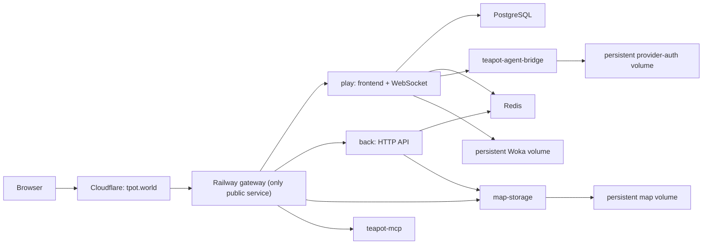

# feat: Deploy Teapot Maps on Railway and tpot.world

## Summary

Provision Teapot Maps as its own Railway project, fronted only by a public gateway at `tpot.world`. Cloudflare owns authoritative DNS and proxies the gateway; every application, database, cache, asset store, MCP endpoint, and hosted-agent bridge remains inside the Teapot Railway private network.

## Problem Frame

The existing beta deployment assumes a single Docker host with Traefik and named Docker volumes. Railway maps those components to separate services and managed/private infrastructure, so a production deployment needs an explicit gateway, service topology, persistent-volume mapping, variables, and release procedure. It must not connect to or deploy into Memex.

## Requirements

- **R1:** `https://tpot.world` serves the WorkAdventure frontend, WebSocket endpoint, APIs, map storage, uploads, icons, and MCP endpoint through one public origin.
- **R2:** The realtime `play` service, supporting API services, database, cache, maps, Woka assets, and provider-auth bridge run in a dedicated Railway project/environment and communicate only through Railway private DNS.
- **R3:** Teapot persisted data and provider authorization state survive deployments.
- **R4:** GitHub changes can automatically deploy only affected Railway services, with health checks and a safe draining window.
- **R5:** No application secret is committed. Production setup names each required Railway variable and Cloudflare DNS action.

## High-Level Technical Design

The following describes the intended deployment boundary; service names are deliberately stable because they are also private DNS names.

## Key Technical Decisions

- **KTD1 — One public gateway:** A small Caddy service owns the only public Railway domain and routes all HTTP/WebSocket paths. This keeps browser same-origin behavior intact and avoids exposing private services.
- **KTD2 — Separate Railway project:** Name the Railway project `tpot-world` and keep its production environment separate from Memex. Railway private networking is project/environment scoped, enforcing this boundary.
- **KTD3 — Managed PostgreSQL and Redis:** Use Railway database services rather than a self-hosted database container. Retain attached volumes for mutable Woka, maps, and provider-auth state.
- **KTD4 — Cloudflare proxy:** Add the apex CNAME and Railway TXT verification record in the Cloudflare zone, enable the orange cloud, and use Cloudflare SSL/TLS mode `Full` as Railway documents for proxied custom domains.
- **KTD5 — Configuration as code:** Each buildable service gets a dedicated Railway config file with a Dockerfile path, watch patterns, health checks, restart policy, and deploy draining window. Railway dashboard holds secrets and the custom config-file path.

## Scope Boundaries

### Included

- Railway topology, gateway proxy, service config, variable contract, volumes, and production runbook.
- Cloudflare DNS, TLS, WebSocket, and cache configuration required for `tpot.world`.
- GitHub-driven production deploy and rollback process.

### Deferred for later

- A managed TURN provider, production video-media server, WAF custom rules, and external backup automation.
- Importing historical Teapot data from a previous host.

### Outside this product's identity

- Memex services, databases, domains, and deployment projects.

## Implementation Units

### U1 — Railway public gateway

- **Files:** Create `contrib/railway/gateway/Dockerfile`; create `contrib/railway/gateway/Caddyfile`; create `contrib/railway/gateway/railway.toml`.
- **Design:** Route WorkAdventure HTTP, `/ws/`, `/api/`, `/map-storage/`, `/uploader/`, `/icon/`, and `/mcp` to their named private services. Health check through Play readiness.
- **Test scenarios:** Caddy validates configuration; `/teapot/health/ready` returns success through the gateway; WebSocket and path prefixes preserve their expected upstream paths.

### U2 — Railway service deployment contracts

- **Files:** Create service-specific `railway.toml` files beneath `contrib/railway/` for Play, Back, Map Storage, Uploader, MCP, and Agent Bridge; create `contrib/railway/docker-compose.railway.yaml` as an import topology.
- **Design:** Reuse the repository Dockerfiles with shared-monorepo watch patterns; configure only internally reachable services except gateway.
- **Test scenarios:** Every config parses as TOML; every Dockerfile path exists; compose config validates without resolved secrets.

### U3 — Production variables and persistent state

- **Files:** Create `contrib/railway/.env.production.template` and `contrib/railway/RAILWAY_CLOUDFLARE_RUNBOOK.md`.
- **Design:** Map old Compose secrets to Railway variables/references and record mandatory volumes plus their mount paths.
- **Test scenarios:** No template value is an active secret; every runtime-required variable in the Teapot overlay is mapped or explicitly deferred.

### U4 — Cloudflare and release operation

- **Files:** Documented in `contrib/railway/RAILWAY_CLOUDFLARE_RUNBOOK.md`.
- **Design:** Add Railway custom domain verification records, configure Cloudflare proxy/TLS/cache behavior, set GitHub deploy gates, smoke test production, and roll back safely.
- **Test scenarios:** First deployment reaches health readiness at `https://tpot.world`; two browsers can connect and see each other; a deploy preserves maps, data, Wokas, and provider authorization state.

## Verification Contract

- Parse every Railway TOML file with a TOML parser.
- Validate the Railway topology with Docker Compose config interpolation using non-secret dummy values.
- Build or inspect the Caddy gateway image and validate its Caddyfile.
- Run the existing Teapot smoke script against `https://tpot.world` after provisioning.
- Complete the beta two-browser acceptance checklist after the initial deployment and each release.

## Risks and Mitigations

- **Cloudflare/Railway custom-domain verification:** Railway requires both its CNAME and TXT records; the runbook makes the actual dashboard-provided values authoritative.
- **Persistent-volume permissions:** Railway volumes mount as root while Node services run as `node`; attach paths to pre-created writable directories and verify readiness after first boot.
- **Realtime stability:** Keep `play` to one replica initially because in-memory room state and WebSocket affinity are not yet proven for horizontal scaling. Add managed TURN before relying on media connections across restrictive networks.
- **Credential exposure:** Keep provider tokens and browser approvals private; do not publish the agent bridge or database services.

## Definition of Done

- The repository contains validated Railway gateway/topology/configuration and a complete first-deploy runbook.
- A standalone Railway project can be created from the configuration without joining Memex infrastructure.
- `tpot.world` is configured as a proxied Railway custom domain once the Railway dashboard produces its CNAME and TXT values.
- Production tests prove browser access, WebSocket/realtime behavior, persistence, and safe repeat deployments.
