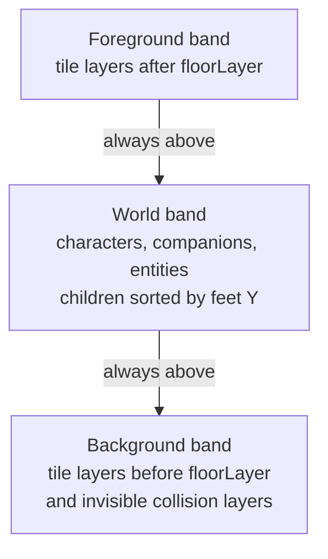

# Centered Render Bands - Plan

## Goal Capsule

Keep the map's fixed, centered coordinate system while making visual stacking independent of absolute world coordinates. Ordinary floor and background tiles must always stay below avatars and entities; intentional foreground tiles must always stay above them; moving world objects must continue to sort by their feet inside their own render band.

---

## Product Contract

### Problem

The current renderer compares root-display-list depths from two unrelated systems: tile layers use fixed depths such as `-2`, while avatars and entities use their absolute world `y` coordinate as depth. After centering the map, valid negative `y` values can fall below the floor depth, so a floor tile covers the avatar. Expanding the map upward can make the same failure recur.

### Requirements

- **R1 — Preserve centered coordinates:** Do not shift map data back to a positive origin and do not derive rendering depth from map bounds.
- **R2 — Stable background band:** Tile layers before the Tiled `floorLayer` marker, including invisible collision tile layers and floor-editor fallback tile images, always render below world objects at every positive or negative coordinate.
- **R3 — Stable foreground band:** Tile layers and floor-editor fallback tile images after `floorLayer` always render above world objects so walls and other intentional occluders keep their fake three-dimensional effect.
- **R4 — Local world sorting:** Characters, companions, and map entities retain their existing feet-based `y` depth formulas, but those values sort only inside the world-object band.
- **R5 — Expansion safety:** Adding map space or objects above the current map must not require rebasing depths or changing existing objects.
- **R6 — Preserve unrelated overlays:** UI, editor overlays, labels, effects, collision, visibility, physics, and input behavior remain unchanged unless a renderable must be explicitly classified to avoid an accidental root-depth tie.

### Acceptance Examples

- **AE1:** An avatar at negative `y`, including above the former disappearance boundary, remains visible over ordinary floor tiles.
- **AE2:** Two characters/entities in the world band still sort by their feet; the lower one appears in front.
- **AE3:** A foreground wall placed after `floorLayer` still covers an avatar walking behind it.
- **AE4:** Expanding the map upward and placing actors at more-negative `y` coordinates does not change any background/world/foreground ordering.
- **AE5:** Rebuilding map tile layers does not destroy or detach the current player or other world objects.

### Scope Boundaries

In scope: the Phaser render hierarchy, tile-layer classification, registration of all moving `y`-sorted world objects, lifecycle handling, focused regression coverage, and browser validation. Out of scope: reversing centered-map conversion, changing collision rules, changing the Tiled `floorLayer` contract, refactoring the floor editor, or globally redesigning fixed-depth UI overlays.

---

## Planning Contract

### Key Technical Decisions

- **KTD1 — Three structural bands:** Create scene-owned Phaser `Layer` containers for background, world objects, and foreground. Parent-layer depth is the primary ordering key; child depth is only a secondary key within a band.
- **KTD2 — Scene-owned lifecycle:** `GameScene` owns the bands for its full lifetime. Live map rebuilds replace tile children only; they never recreate the world band or destroy its actors.
- **KTD3 — Explicit tile classification:** `GameMapFrontWrapper` switches from the background band to the foreground band at the existing `floorLayer` marker and preserves Tiled insertion order within each band. The wrapper exposes each source tile layer's band so editor fallback images can use the same structural parent.
- **KTD4 — Common actor hooks:** Register local and remote players through `Character`, companions through the character creation path, and map-editor entities through `Entity`. Existing `y`-derived child depths stay intact.
- **KTD5 — No coordinate rebasing:** No min-Y offset, map-height calculation, or depth waterfall is introduced. Negative and positive coordinates remain valid forever.
- **KTD6 — Avoid root ties:** Tiled object text and legacy actionable computer sprites join the background band, matching their existing role below ordinary positive-Y actors and intentional foreground tiles. Entity activation debug graphics join the world band with their existing `entity.depth + 1000` local offset, keeping them above their entity but below the foreground band.

### Assumptions and Evidence

- Phaser 4.2 `Layer.add()` moves a child from the scene display list into the layer, and child depth sorting is local to that layer.
- Phaser's layer renderer supplies parent transforms to both CPU and GPU tilemap-layer renderers, so both tile paths support structural nesting.
- Physics and input remain attached to children moved into a Phaser layer.
- Destroying a Phaser layer destroys its children, which is why bands must outlive map-wrapper rebuilds.

### Sequence

1. Add and unit-test the scene-owned render-band abstraction.
2. Route map tile layers into background/foreground bands without changing the wrapper's collision or visibility collections.
3. Route every `y`-sorted actor/entity into the world band and classify default-depth/debug renderables.
4. Run focused and full static/unit validation.
5. Browser-test negative coordinates, intentional foreground occlusion, and live upward expansion/rebuild behavior.

---

## Implementation Units

### U1 — Render-band abstraction

**Files:** `play/src/front/Phaser/Game/GameRenderLayers.ts`, `play/tests/front/Phaser/Game/GameRenderLayers.test.ts`

Create the three long-lived Phaser layers with non-overlapping root depths and narrow methods for adding background, world, and foreground children. Prove that arbitrarily negative child depths cannot cross bands, world children still sort relative to each other, tile child replacement does not affect actors, and CPU/GPU tile-shaped game objects use the same API.

### U2 — Tile-layer ownership and lifecycle

**Files:** `play/src/front/Phaser/Game/GameScene.ts`, `play/src/front/Phaser/Game/GameMap/GameMapFrontWrapper.ts`, `play/src/front/Phaser/Game/MapEditor/Tools/FloorEditorTool.ts`, focused wrapper/render tests

Instantiate render bands before the first map wrapper, retain them through map rebuilds, and pass them explicitly to every wrapper instance. Replace the mutable root-depth switch with a band switch at `floorLayer`. Add synthetic entity, area, and void collision tile layers to the background band while leaving `phaserLayers` and all collision/visibility/editor behavior intact. Route actual tile fallback images created by the floor editor into their source layer's background or foreground band; keep hover, path, and control overlays in their existing UI overlay path.

### U3 — World-object registration

**Files:** `play/src/front/Phaser/Entity/Character.ts`, `play/src/front/Phaser/ECS/Entity.ts`, companion creation path, `play/src/front/Phaser/Components/TextUtils.ts`, `play/src/front/Phaser/Items/Computer/computer.ts`

Move characters, companions, and map entities into the world band after adding them to the scene. Keep their current feet-based child depth formulas. Place Tiled object text and legacy computer sprites in the background band. Place entity activation debug graphics in the world band with their existing local offset rather than leaving them at a world-coordinate-derived root depth.

### U4 — Regression verification

**Files:** new focused unit/runtime-state tests and the smallest suitable browser fixture/spec

Cover negative-Y avatar visibility, cross-zero world-object Y sorting, foreground wall occlusion, floor-editor fallback images in both tile bands, late actor/entity creation and removal, tile rebuild safety, and upward expansion without actor coordinate/depth/parent changes. Prefer state assertions over source-string assertions.

---

## Verification Contract

Run from `play/`:

1. `npm test -- --run tests/front/Phaser/Game/GameRenderLayers.test.ts`
2. Any additional focused regression tests added for wrapper and actor registration
3. `npm run typecheck`
4. `npm run svelte-check`
5. `npm run lint`
6. `npm run pretty-check`
7. `npm test`
8. `npm run build`
9. Browser smoke test across the former negative-Y disappearance boundary, behind an intentional foreground wall, and after upward map expansion/rebuild

The fix is complete when all automated checks pass and browser state proves the three band invariants without changing map coordinates.

---

## Definition of Done

- The map remains centered and supports arbitrary negative coordinates.
- Floors/backgrounds cannot cover world actors because of absolute `y`.
- Foreground occluders still cover actors intentionally.
- Characters, companions, and entities still Y-sort inside the world band.
- Map rebuild and upward expansion require no depth recalculation.
- Focused regression tests, full validation, and browser checks pass.
- Unrelated dirty-worktree changes remain untouched.
