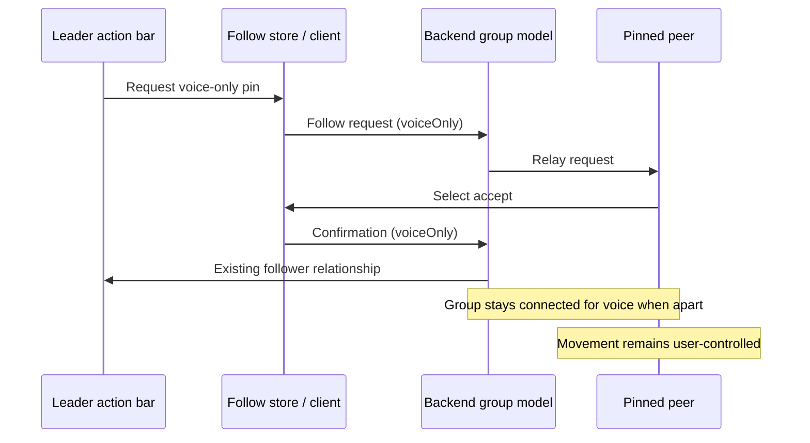

# Voice-Only Pin - Plan

## Goal Capsule

- **Objective:** Add a voice-only pin action beside Follow so nearby users can remain in the same voice connection without automatic movement.
- **Authority:** The user's request controls this new connection mode; established manual stop, departure, and scene-cleanup behavior remains authoritative.
- **Stop conditions:** Do not change spatial-audio behavior for unpinned users, or make voice pins survive a participant leaving the room or scene.

---

## Product Contract

### Summary

The action bar will offer a distinct voice-pin control alongside Follow whenever a proximity discussion can be started.
Accepting a voice pin preserves the existing server-side group relationship that keeps voice connected, but the pinned user retains normal movement.
Either participant can explicitly unpin, and normal disconnect and scene-lifecycle cleanup still end the relationship.

### Requirements

- R1. The action bar exposes a Voice pin action beside Follow when initiating a proximity relationship is available.
- R2. A voice-pin request is visibly distinct from a movement-follow request at request, confirmation, active-status, and stop points.
- R3. Accepted voice pins keep the participants in the existing voice/group relationship even when their positions separate, without driving the pinned player's movement.
- R4. The connection type is carried through the existing request and confirmation protocol so both clients agree on whether it is movement-follow or voice-only.
- R5. Explicit unpin, participant departure, and scene teardown retain the established abort and cleanup behavior.

### Scope Boundaries

- Voice pin reuses the current follow relationship's one-leader/many-followers semantics; it does not introduce an arbitrary participant picker or a second audio transport.
- A user can have one active relationship mode at a time; switching between movement follow and voice pin requires ending the current relationship first.
- This change does not alter microphone state, individual volume, video, or group-lock behavior.

### Acceptance Examples

- AE1. Given users in a proximity discussion, when a leader chooses Voice pin and a peer accepts, then their voice connection remains active while the peer moves independently.
- AE2. Given an active voice pin, when the pinned player moves away, then automatic follow movement is never applied.
- AE3. Given an active voice pin, when either participant selects the voice-pin stop control, then the normal abort protocol disconnects that relationship.
- AE4. Given a voice-pin request or active pin, when a participant leaves or the scene closes, then the existing server/client lifecycle cleanup removes it.

---

## Planning Contract

### Key Technical Decisions

- KTD1. Extend the existing follow request and confirmation messages with a backward-compatible `voiceOnly` boolean rather than adding a parallel connection protocol. The backend's existing follower relationship already causes far-apart members to remain in one group for voice transport.
- KTD2. Model connection kind separately from the lifecycle state in `FollowStore`. This lets the existing `off`, `requesting`, `active`, and `ending` state machine remain intact while movement is enabled only for the movement-follow mode.
- KTD3. Reuse the existing follow popup and abort controls, with voice-specific copy and labels, so user consent and lifecycle cleanup stay consistent.

### High-Level Technical Design

### Assumptions

- Existing follower group semantics are the desired way to pin voice: they preserve the current proximity audio transport rather than starting a separate call.
- The existing consent prompt applies to voice pin, with mode-specific wording.

### Sources and Research

- `back/src/Model/GameRoom.ts` preserves groups containing followers that are out of normal proximity bounds.
- `play/src/front/Phaser/Player/Player.ts` is the movement seam; it currently follows only for active follower state.
- `play/src/front/Phaser/Game/FollowManager.ts`, `play/src/front/Stores/FollowStore.ts`, and `play/src/front/Components/PopUp/PopUpFollow.svelte` define the existing request, confirmation, status, and abort experience.

---

## Implementation Units

### U1. Carry the connection mode through the existing follow protocol

- **Goal:** Let requesters, recipients, and leaders distinguish voice-only pins from movement follows without changing group ownership.
- **Requirements:** R2, R4, R5.
- **Dependencies:** None.
- **Files:** `messages/protos/messages.proto`, `libs/messages/src/ts-proto-generated/messages.ts`, `play/src/front/Connection/RoomConnection.ts`, `back/src/Services/SocketManager.ts`, `back/src/Model/User.ts`.
- **Approach:** Add a default-false `voiceOnly` field to both request and confirmation messages. Relay and emit the selected mode through the established flow, preserving default behavior for existing movement-follow messages and all abort messages.
- **Patterns to follow:** The existing `forceFollow` request flag and `FollowConfirmationMessage` forwarding path.
- **Test scenarios:** Covers AE1. A voice-pin request and confirmation preserve `voiceOnly` end to end. Existing messages that omit the field behave as movement follow. Covers AE4. Abort messages remain mode-independent.
- **Verification:** Generated message types compile in frontend and backend consumers, and the normal follow path retains default movement semantics.

### U2. Separate voice pin from automatic movement and lifecycle presentation

- **Goal:** Keep voice pins active for audio while allowing the pinned player to walk freely, with a clear consent and stop experience.
- **Requirements:** R2, R3, R5.
- **Dependencies:** U1.
- **Files:** `play/src/front/Stores/FollowStore.ts`, `play/src/front/Phaser/Game/FollowManager.ts`, `play/src/front/Phaser/Player/Player.ts`, `play/src/front/Components/PopUp/PopUpFollow.svelte`, `play/src/i18n/en-US/follow.ts`.
- **Approach:** Store the active connection mode with the existing follow lifecycle. Apply automatic movement only when the role is follower and the mode is movement follow. Render voice-pin requests, status, and explicit stop labels through the existing popup; use the same abort route for manual and lifecycle cleanup.
- **Patterns to follow:** Existing follow-state subscriptions and the `Player.computeFollowMovement` safety guard.
- **Test scenarios:** Covers AE1. Accepting a voice pin enters active voice mode. Covers AE2. An active voice-mode follower never calls movement-follow computation. Covers AE3. Explicit stop sends the current abort protocol and clears mode/state. Covers AE4. Received abort and scene close reset voice mode.
- **Verification:** The mode changes only user movement behavior; server-owned group and abort cleanup are unchanged.

### U3. Add the voice-pin action bar control and regression coverage

- **Goal:** Provide a discoverable, independently controllable Voice pin button beside Follow.
- **Requirements:** R1, R2, R3, R5.
- **Dependencies:** U1, U2.
- **Files:** `play/src/front/Components/ActionBar/MenuIcons/VoicePinMenuItem.svelte`, `play/src/front/Components/ActionBar/MenuIcons/ContextualMenuItems.svelte`, `play/src/i18n/en-US/actionbar.ts`, `play/tests/front/Phaser/Game/FollowPersistence.test.ts`.
- **Approach:** Mirror the action-bar button conventions used by `FollowMenuItem`. Present Follow and Voice pin together before a relationship starts; once one mode is active, show its matching manual-stop action to avoid silently switching the relationship type.
- **Patterns to follow:** `FollowMenuItem.svelte`, `ActionBarButton.svelte`, and existing raw-source regression tests where a Phaser fixture would require unrelated rendering setup.
- **Test scenarios:** Covers AE1. The action-bar source renders Voice pin beside Follow when eligible. Covers AE2. Voice mode cannot use the movement-follow branch. Covers AE3. The voice button uses explicit abort, not automatic cleanup. Covers AE4. Cleanup paths reset the mode along with follow state.
- **Verification:** The user can initiate and explicitly end a voice-only pin without losing freedom of movement.

---

## Verification Contract

| Scope | Command | Done signal |
|---|---|---|
| Protocol generation | `cd messages && npm run ts-proto` | Generated types expose `voiceOnly` with a false default. |
| Focused regression | `cd play && npm test -- --run tests/front/Phaser/Game/FollowPersistence.test.ts` | Follow and voice-pin mode regression tests pass. |
| Frontend checks | `cd play && npm run typecheck && npm run lint && npm run pretty-check && npm run build` | Modified frontend, generated types, and UI compile cleanly. |
| Backend checks | `cd back && npm run typecheck && npm test` | Protocol consumers and follow lifecycle compile and tests pass. |

---

## Definition of Done

- Voice pin appears beside Follow and has mode-specific request, active, and stop copy.
- An accepted voice pin keeps the existing voice/group connection while the pinned player keeps normal movement control.
- Standard follow continues to move followers, and absent protocol fields retain standard-follow behavior.
- Explicit unpin, user departure, and scene teardown still use established abort and cleanup flows.
- The generated protocol artifacts and focused regression coverage are included with no unrelated changes.
