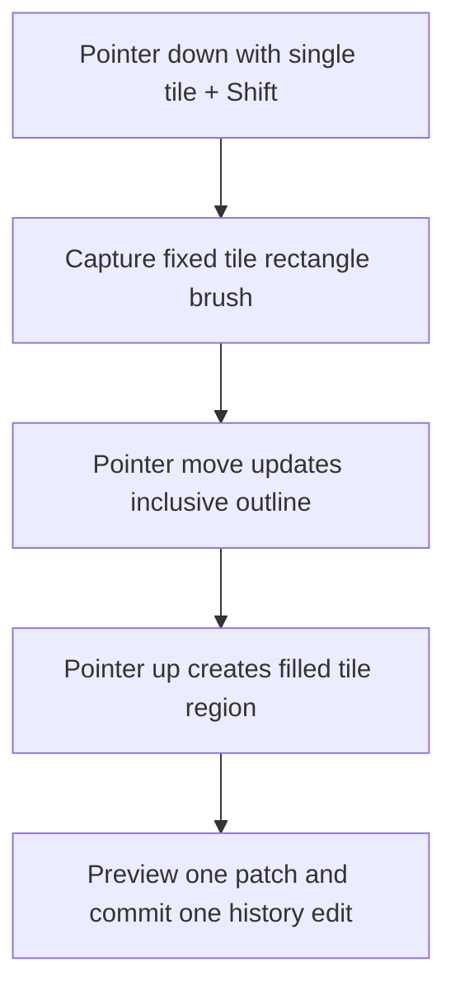

# Shift tile rectangle painting - Plan

## Goal Capsule

- **Objective:** Let a selected single-tile floor brush fill an inclusive rectangle while Shift is held during drag.
- **Authority:** The user's requested editor behavior takes precedence; existing manual painting, autotile shapes, undo grouping, and panning remain intact.
- **Execution profile:** Extend the floor editor's existing rectangle-preview and one-patch commit lifecycle.
- **Stop conditions:** The Shift gesture preserves one selected GID for every rectangle cell and focused tests plus static checks pass.

---

## Product Contract

### Summary

The floor editor will treat a Shift-held drag with a single-tile brush as a rectangle fill rather than a freehand paint stroke.

### Problem Frame

Single-tile brushes currently paint each crossed cell individually.
The editor supports rectangle dragging only for terrain-family autotile shapes, so a creator cannot quickly fill an area with one selected tile.

### Requirements

- R1. With a single-tile brush selected, holding Shift before primary-pointer drag starts a rectangular paint gesture.
- R2. The rectangle uses the selected tile GID for every inclusive cell, including reverse and one-cell-wide drags.
- R3. The gesture previews its bounds during drag and persists one terrain patch as one undoable edit on pointer release.
- R4. Existing freehand tile painting, terrain-family autotile shapes, and no-brush panning retain their current behavior; Shift rectangle fill also applies to the eraser's zero-GID brush.

### Scope Boundaries

- No new toolbar control or persistent rectangle mode.
- No changes to terrain-family nine-slice autotile selection.
- No polygon, lasso, or flood-fill behavior.

---

## Planning Contract

### Key Technical Decisions

- KTD1. Capture Shift state at pointer-down and store the active rectangle brush so releasing Shift before pointer-up does not change the committed region.
- KTD2. Reuse the current inclusive-bound normalization, hover clearing, rectangle outline, patch preview, and one-edit commit path shared by autotile shape drawing.
- KTD3. Generate a row-major filled tile region through a pure helper, allowing direct tests to prove that every cell receives the selected GID.

### High-Level Technical Design

### Assumptions

- Shift is sampled at the beginning of the drag, matching the editor's existing gesture-style modifier handling and avoiding a partial freehand stroke.

### Sources and Research

- `play/src/front/Phaser/Game/MapEditor/Tools/FloorEditorTool.ts` already owns the autotile rectangle drag lifecycle and grouped history commit.
- `play/src/common/Teapot/TerrainAutotile.ts` already owns inclusive rectangle normalization and deterministic row-major regions.
- `play/tests/front/Phaser/Game/MapEditor/TerrainAutotile.test.ts` provides the focused pure-helper regression pattern.

---

## Implementation Units

### U1. Generate fixed-tile rectangle regions

- **Goal:** Provide a pure region builder that normalizes drag bounds and repeats a single GID for each selected cell.
- **Requirements:** R2
- **Dependencies:** None.
- **Files:** `play/src/common/Teapot/TerrainAutotile.ts`, `play/tests/front/Phaser/Game/MapEditor/TerrainAutotile.test.ts`.
- **Approach:** Add a companion to the nine-slice region helper that returns the normalized bounds with a row-major GID array filled from the active single-tile brush.
- **Patterns to follow:** `normalizeTerrainRectangle`, `createTerrainAutotileRegion`.
- **Test scenarios:** A forward rectangle repeats one GID in every cell; a reverse drag normalizes coordinates; a one-cell rectangle remains valid.
- **Verification:** The focused terrain-autotile suite proves exact region bounds and GID arrays.

### U2. Route Shift-held single-tile drags through the rectangle lifecycle

- **Goal:** Start, preview, and commit a fixed-tile rectangle when Shift is held with a normal tile brush.
- **Requirements:** R1, R2, R3, R4
- **Dependencies:** U1.
- **Files:** `play/src/front/Phaser/Game/MapEditor/Tools/FloorEditorTool.ts`, `play/tests/front/Phaser/Game/MapEditor/FloorEditorRendering.test.ts`.
- **Approach:** Register the Phaser Shift key, capture a discriminated active shape brush at pointer-down, update the existing outline while dragging, and on release choose either the existing autotile region or the fixed-tile region before previewing and committing it as one edit. Keep normal pointer-down painting for a tile brush when Shift is not held.
- **Patterns to follow:** Existing `selectedAutotile`, `shapeStart`/`shapeEnd`, `finishShapeDrag`, and `EntityEditorTool` keyboard-key registration.
- **Test scenarios:** Shift-held single-tile pointer-down enters the rectangle path; fixed-tile completion uses the selected GID builder; autotile completion remains on its nine-slice builder; ordinary paint remains a stroke path.
- **Verification:** Focused floor-editor tests and TypeScript/lint checks pass.

---

## Verification Contract

| Gate | Scope | Done signal |
| --- | --- | --- |
| Focused Vitest | `TerrainAutotile.test.ts` and floor-editor regressions | Filled regions, Shift routing, and existing shape routing pass |
| TypeScript | `play` workspace | No type errors from new gesture state |
| Lint and formatting | Changed `play` TypeScript files | Project conventions pass |
| Browser smoke | Local floor editor | Shift-drag fills a forward and reverse rectangle with one selected tile; ordinary drag still paints a stroke |

## Definition of Done

- A selected single tile can fill an inclusive rectangle through a Shift-held drag.
- Every cell in that rectangle contains the selected tile GID.
- The result is previewed and saved as one history edit.
- Existing autotile shapes and freehand tile painting continue to work.
- Focused tests and relevant static checks pass.
