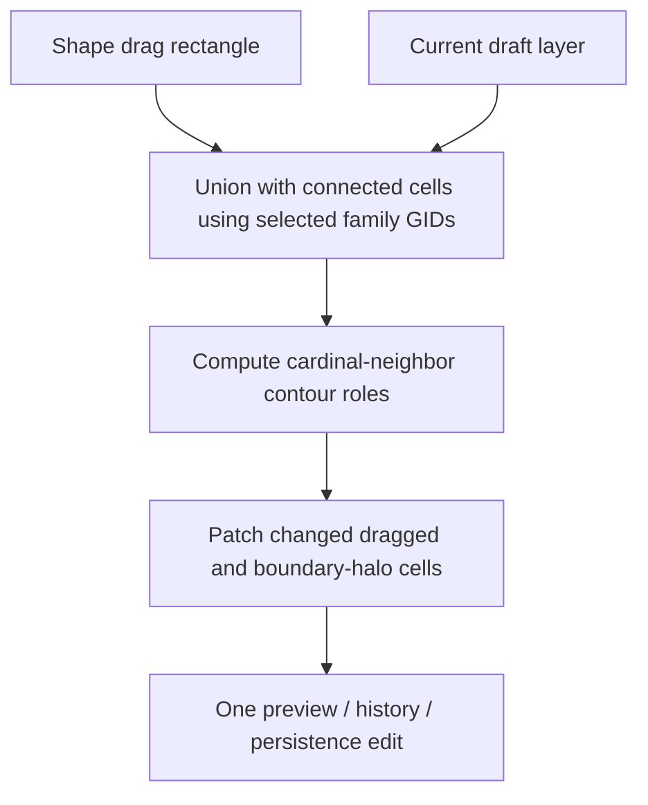

## Goal Capsule

- **Objective:** Make a shape drag of the selected terrain family extend a touching or overlapping field as one continuous surface, with the outer edge and corners retiled so no internal seam remains.
- **Authority:** Preserve the existing shape-drag, preview, one-edit undo/history, and persistence lifecycle.
- **Stop conditions:** Matching-family connected fields merge correctly; separate or different-family terrain is unchanged; focused tests and static checks pass.

---

## Product Contract

### Summary

Shape drawing currently emits a new nine-slice rectangle without considering the selected layer's existing terrain cells.

### Problem Frame

When a user grows a field using the same terrain-family shape brush, the new rectangle verbatim-overwrites its footprint while both regions retain their facing edge tiles.
That creates visible slits and incorrect corner pieces instead of the liquid-like union the interaction implies.

### Requirements

- R1. A shape drag that overlaps or shares an edge with existing tiles from the active terrain family must produce one contiguous field with no internal boundary.
- R2. The resulting field must use the family’s verified center, edge, outer-corner, and inner-corner GIDs according to its contour.
- R3. Terrain from other families, non-touching terrain, and fixed-GID rectangle brushes must not be merged or retiled.
- R4. Shape drags remain preview-only until pointer-up and commit as one undoable floor edit.

### Scope Boundaries

- The change covers cardinally connected or overlapping cells in the active terrain family.
- It does not add arbitrary Wang-set or diagonal automapping, change manual tile painting, or bridge truly separated terrain regions.

---

## Planning Contract

### Key Technical Decisions

- KTD1. Treat the selected family’s catalogued contour GIDs as the sole membership definition; expose the catalog’s verified inner-corner variants explicitly rather than inferring terrain identity from atlas position or visual appearance.
- KTD2. Build an occupancy union from the dragged rectangle plus connected matching-family cells on the selected layer, then retile only affected occupied cells using cardinal-neighbor exposure.
- KTD3. Include a local boundary halo in the emitted patch so pre-existing cells whose edge role changes are refreshed, while preserving the current single pointer-up patch/history action.

### Assumptions

- Diagonally touching regions remain separate unless a drag places cardinally connected terrain between them.
- Existing layer access utilities can provide source GIDs without changing the TMJ persistence contract.

### High-Level Technical Design

---

## Implementation Units

### U1. Generate a map-aware merged terrain contour

- **Goal:** Produce terrain tile updates that retile a dragged shape and the connected same-family field as one contour.
- **Requirements:** R1, R2, R3.
- **Dependencies:** None.
- **Files:** `play/src/common/Teapot/TerrainAutotile.ts`, `play/src/common/Teapot/BuiltInTerrainCatalog.ts`, `play/tests/front/Phaser/Game/MapEditor/TerrainAutotile.test.ts`.
- **Approach:** Extend the terrain-family contour data to name the verified inner-corner GIDs, then add a focused helper that receives the new rectangle, active terrain-family GIDs, and a way to read the source layer. It should identify connected matching-family cells, unite them with the incoming rectangle, determine each occupied cell’s cardinal-neighbor topology (including concave joins), and return compact patch regions for changed cells without filling unoccupied gaps.
- **Patterns to follow:** Preserve inclusive/reverse-drag normalization and row-major tile behavior from `createTerrainAutotileRegion`; use the catalog-provided terrain variants as authoritative membership.
- **Test scenarios:** A horizontal attachment removes both facing edge tiles and keeps the new outer corners; a vertical attachment does the same; an overlap and reverse drag retile the complete union; L and T joins select inner-corner variants; a one-cell bridge joins fields only when the drag actually supplies the connecting cell; non-touching, diagonal-only, and different-family tiles remain unmodified; the existing rectangle behavior stays deterministic.
- **Verification:** Unit tests prove the merged contour chooses centers internally and correct edges/corners externally.

### U2. Use merged contours for terrain shape commits

- **Goal:** Feed the active draft map into same-family contour generation when finishing an autotile shape drag.
- **Requirements:** R1, R3, R4.
- **Dependencies:** U1.
- **Files:** `play/src/front/Phaser/Game/MapEditor/Tools/FloorEditorTool.ts`, `play/tests/front/Phaser/Game/MapEditor/FloorEditorRendering.test.ts`, `play/tests/front/Phaser/Game/MapEditor/FloorEditorHistory.test.ts`.
- **Approach:** Replace only the autotile branch in `finishShapeDrag`; retain fixed-GID rectangle behavior, collision-region handling, patch parsing, preview rendering, and the one-edit commit path. Read from the currently visible draft before constructing the terrain patch.
- **Patterns to follow:** Keep shape-drag state in `shapeStart`, `shapeEnd`, and `shapeBrush`; use the existing `createFloorEdit` and `preview(..., false)` flow.
- **Test scenarios:** Pointer movement remains non-mutating; pointer-up for a merged terrain drag produces one patch/edit; undo restores the pre-drag region; ordinary tile/eraser and Shift fixed-GID rectangles retain their current behavior.
- **Verification:** Targeted floor-editor tests assert the existing one-commit lifecycle while the terrain helper tests establish the contour output.

---

## Verification Contract

| Scope | Command | Done signal |
| --- | --- | --- |
| Terrain contour | `npm test -- --run tests/front/Phaser/Game/MapEditor/TerrainAutotile.test.ts` from `play/` | Merged and non-merged contour cases pass. |
| Floor editor lifecycle | `npm test -- --run tests/front/Phaser/Game/MapEditor/FloorEditorRendering.test.ts tests/front/Phaser/Game/MapEditor/FloorEditorHistory.test.ts` from `play/` | Shape interaction and history expectations pass. |
| Static validation | `npm run typecheck && npm run lint && npm run pretty-check` from `play/` | No type, lint, or formatting errors in the edited code. |

## Definition of Done

- Same-family shape drags visually behave as a single expanding terrain field with no internal edge seam.
- Only the selected terrain family’s connected contour is retiled, with correct outer and inner edge/corner variants.
- Shape preview, undo/redo, fixed-GID rectangle, and ordinary painting behavior remain intact.
- The verification contract passes.
