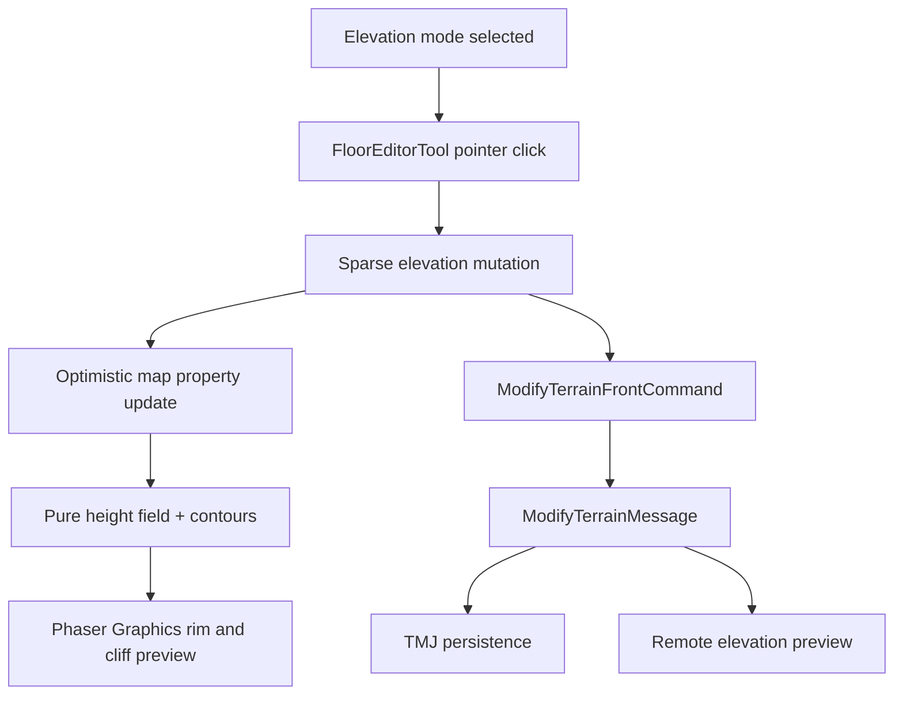

## Goal Capsule

- **Objective:** Give map editors a dedicated Elevation mode with continuous press-and-drag sculpting, Command-drag lowering, a Shift-selected 5×5 area brush, and automatic one-step-per-cell falloff into surrounding terrain. Heights remain capped at twenty half-tile steps.
- **Authority hierarchy:** The editable elevation field is canonical; the smooth contour, rim, and cliff shading are derived presentation. Existing tile painting, collision, and map editing behavior remain canonical outside Elevation mode.
- **Stop conditions:** This slice persists and synchronizes elevation edits, supports local undo/redo, caps a cell at 20, and renders an editable preview. It does not yet change player movement, path routing, camera, or asset-specific cliff styling.

---

## Product Contract

### Problem Frame

Terrain can currently be painted as connected tile art, but its surface remains flat. Editors need a direct, SimCity-like way to sculpt a user-owned landform without needing a fixed library of mountain corners or manually drawn cliffs.

### Requirements

- R1. Terrain mode exposes an Elevation tool whenever a visual floor layer exists.
- R2. Hovering a map cell in Elevation mode previews its next height and its connected contour.
- R3. A primary click increases only the hovered cell by one whole elevation step, from 0 through a hard maximum of 20; repeated clicks at 20 are no-ops.
- R4. One elevation step renders as half a tile height: a 32px tile uses a 16px vertical extrusion per step.
- R5. Height data persists in the TMJ map document, synchronizes through the existing terrain edit command, and supports undo/redo with ordinary terrain mutations.
- R6. The renderer derives smooth shared contours, a surface rim, and a downward cliff strip from the height field rather than requiring pre-authored slope or corner assets.
- R7. The selected floor texture remains visually underneath the generated elevated surface; no texture is stretched or rewritten by elevation edits.
- R8. Existing floor, shape, water, path, and eraser behavior remains unchanged outside Elevation mode.

### Scope Boundaries

- Deferred for later: terrain lowering, smooth/flatten brushes, landscape-wide sculpt gestures, paths that evaluate grade, height-aware player movement/depth, camera response, and generated biome/cliff art.
- Outside this slice: a Phaser fork, a 3D physics engine, or replacing standard floor tiles with a mesh-only map format.

---

## Planning Contract

### Key Technical Decisions

- KTD1. Store an elevation field as a TMJ map property keyed by signed tile coordinates. It is independent of paint tiles, remains valid for finite and centered maps, and avoids treating arbitrary tileset GIDs as height data.
- KTD2. Extend `TeapotTerrainMutation` and `ModifyTerrainMessage` with sparse elevation changes. This preserves the established optimistic preview, command history, Room broadcast, and map-storage persistence path.
- KTD3. Build contour geometry as a pure, Phaser-free height-field helper. It clamps values to 0–20, produces a deterministic shared boundary from neighboring cells, and lets rendering be tested separately from map state.
- KTD4. Render only an editor-scoped `Graphics` overlay in the first slice: tile textures stay in normal tile layers, while the overlay fills the raised plateau, draws a rounded contour/rim, and extrudes the boundary down by `tileHeight / 2` per step. Rebuild only the changed cell's local halo.

### High-Level Technical Design

### Assumptions

- The first visual treatment is intentionally style-neutral: a translucent surface tint plus shaded cliff strip proves the generated-contour model before per-surface masks and materials are introduced.
- Elevation cells are scoped to the selected visual floor layer so independent floors can later have independent terrain.

---

## Implementation Units

### U1. Persist sparse elevation changes with ordinary terrain edits

- **Goal:** Make a bounded, layer-scoped height field part of the canonical TMJ mutation lifecycle.
- **Requirements:** R3, R5.
- **Files:** `libs/map-editor/src/Authoring/TeapotTerrainMutation.ts`, `libs/map-editor/src/Authoring/ElevationTerrain.ts`, `libs/map-editor/src/index.ts`, `messages/protos/messages.proto`, `libs/messages/src/ts-proto-generated/messages.ts`, `play/src/front/Connection/RoomConnection.ts`, `back/src/Model/GameRoom.ts`, `map-storage/src/Services/TerrainPersistenceService.ts`.
- **Approach:** Add sparse `{ layer, x, y, elevation }` updates to terrain mutations; apply them immutably into a compact map property, deleting zero values and rejecting values outside 0–20. Carry the updates through the generated protobuf and every existing terrain mutation adapter.
- **Test scenarios:** A zero-to-one click persists; an existing cell increments; 20 remains capped; zero removes storage; unrelated TMJ fields are preserved; encoded command round-trips updates; map-storage persists the same field.
- **Verification:** Shared map-editor, protocol, and map-storage terrain tests pass.

### U2. Derive deterministic smooth elevation contours

- **Goal:** Turn the stored height field into stable, local contour and cliff geometry without baked mountain assets.
- **Requirements:** R4, R6, R7.
- **Dependencies:** U1.
- **Files:** `libs/map-editor/src/Authoring/ElevationTerrain.ts`, `libs/map-editor/tests/ElevationTerrain.test.ts`.
- **Approach:** Use a deterministic marching-squares-style contour helper around each non-zero band, smooth its grid vertices into rounded paths, and provide the exposed edge height necessary for vertical extrusion. Keep coordinates and geometry independent of Phaser.
- **Test scenarios:** Isolated cell, adjacent cells, diagonal contact, concave corner, map edge/signed coordinates, multiple height bands, and a 20-step cell produce deterministic contours with half-tile extrusion values.
- **Verification:** Focused geometry tests pass.

### U3. Add Elevation mode and live Phaser overlay

- **Goal:** Expose click-to-raise editing and show the selected layer's generated terrain shape immediately.
- **Requirements:** R1, R2, R3, R4, R6, R8.
- **Dependencies:** U1, U2.
- **Files:** `play/src/front/Components/MapEditor/FloorEditor/FloorEditorModes.ts`, `play/src/front/Components/MapEditor/FloorEditor/FloorEditor.svelte`, `play/src/front/Stores/MapEditorFloorStore.ts`, `play/src/front/Phaser/Game/MapEditor/Tools/FloorEditorTool.ts`, `play/tests/front/Phaser/Game/MapEditor/ElevationEditor.test.ts`, `play/tests/front/Phaser/Game/MapEditor/FloorEditorRendering.test.ts`.
- **Approach:** Add an Elevation mode and elevation action/selection state. In that mode, primary pointer-down creates one sparse increment mutation and uses the existing command/history lifecycle. A dedicated `Graphics` overlay reads the active layer's field, previews the hovered next step, and redraws the affected local contour halo with a tinted plateau, rim, and shaded extrusion; it is cleared on tool teardown or mode change.
- **Test scenarios:** Mode selection is available only with a floor layer; hover shows next-step state; click increments one cell; click at 20 emits no command; a remote mutation refreshes the overlay; non-elevation tools retain their present pointer behavior; undo and redo restore the visual height field.
- **Verification:** Focused play editor tests pass and the play typecheck succeeds.

---

## Verification Contract

| Scope                  | Command                                                                                                                                                       | Done signal                                          |
| ---------------------- | ------------------------------------------------------------------------------------------------------------------------------------------------------------- | ---------------------------------------------------- |
| Shared elevation field | `npm test --workspace=@workadventure/map-editor -- tests/ElevationTerrain.test.ts`                                                                            | Bounds, serialization, and contour geometry pass.    |
| Editor behavior        | `npm test --workspace=play -- --run tests/front/Phaser/Game/MapEditor/ElevationEditor.test.ts tests/front/Phaser/Game/MapEditor/FloorEditorRendering.test.ts` | Click, preview, undo, and rendering contracts pass.  |
| Terrain transport      | `npm test --workspace=play -- --run tests/front/Phaser/Game/MapEditor/TerrainProtocol.test.ts`                                                                | Sparse elevation fields survive the editor protocol. |
| Persistence            | `npm test --workspace=@workadventure/map-storage -- src/Services/tests/TerrainPersistenceService.test.ts`                                                     | TMJ write preserves elevation edits.                 |
| Type safety            | `cd play && npm run typecheck`                                                                                                                                | No TypeScript errors in the client.                  |

## Definition of Done

- An editor can enter Elevation mode, hover any floor cell, and raise it one half-tile step per click up to 20.
- The map displays a coherent rounded elevated plateau with a visible downward cliff treatment, including when neighboring cells have different heights.
- Elevation edits save, synchronize, undo, redo, and reload through the existing terrain command path.
- Floor tiles remain unmodified by elevation edits and every existing terrain mode still behaves as before.
- Tests cover the bounded field, contour derivation, transport/persistence, and pointer-mode behavior; abandoned experimental rendering code is removed.
