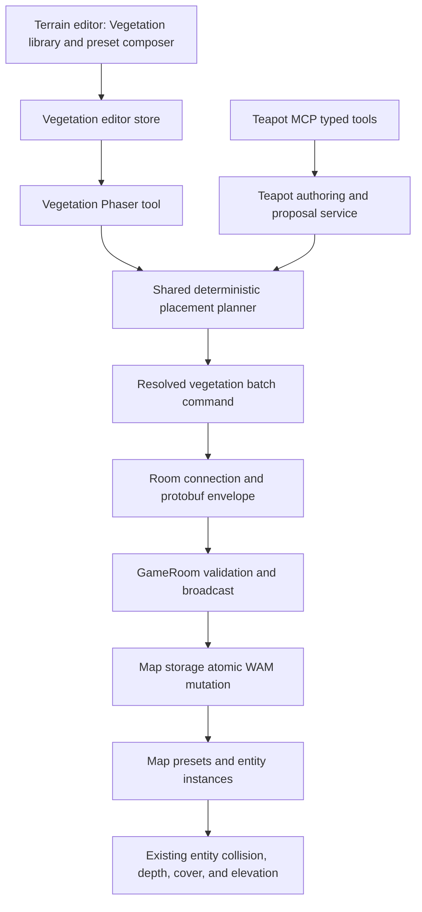
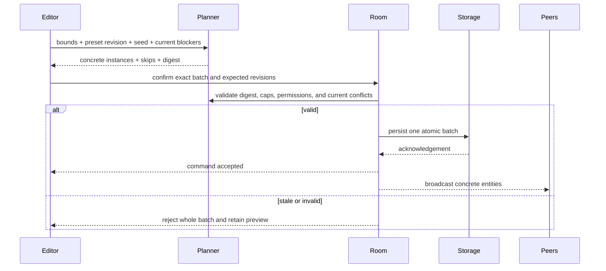
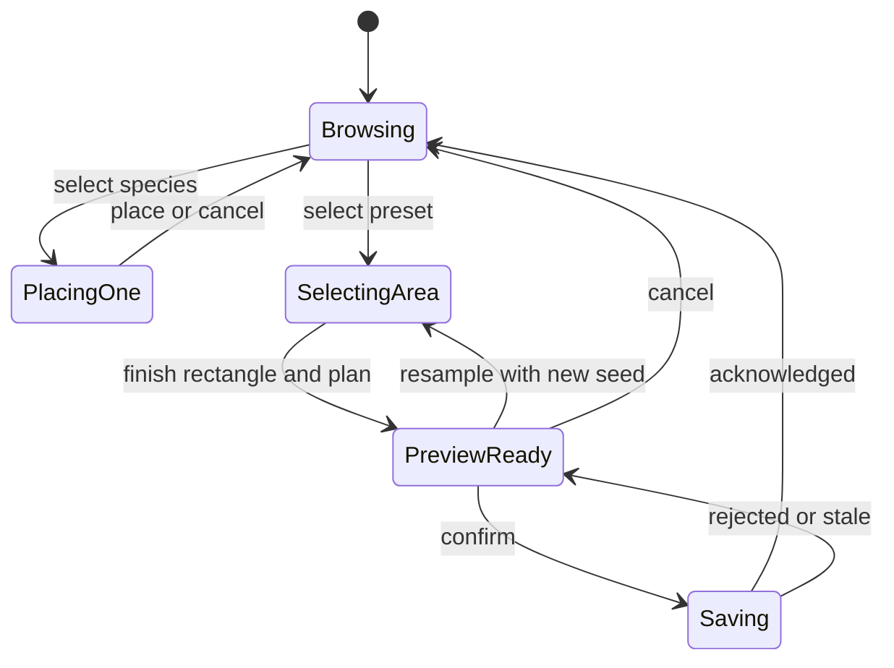

# Vegetation Authoring and Area Fill - Plan

## Goal Capsule

- **Objective:** Add vegetation to the terrain editor as reusable, style-agnostic species that can be placed individually or distributed across a selected area with deterministic, reusable presets.
- **Authority order:** This Product Contract governs behavior; the Planning Contract governs implementation; current WorkAdventure schemas and scoped `AGENTS.md` files govern local conventions.
- **Execution profile:** Extend the existing custom-entity, generated-asset, map-editor command, persistence, elevation, and MCP authoring systems. Do not build a separate vegetation renderer or map format.
- **Stop conditions:** Stop and surface a blocker if implementation would require raw TMJ/WAM exposure, partial bulk persistence, rerandomizing an approved preview, or changing the established elevation-collision model.
- **Tail ownership:** The implementation owns schemas, editor UI, realtime synchronization, persistence, undo, MCP parity, migration compatibility, and focused runtime/E2E verification.

---

## Product Contract

### Summary

The terrain editor will list vegetation beside terrain assets while preserving the distinction between ground surfaces and world objects. A vegetation species is a reusable tree, bush, grass, or similar prefab with visual, footprint, collision, and depth metadata. A vegetation preset is a reusable weighted recipe that distributes species across a selected area. Area fills resolve to ordinary editable entities, so collaborators see the same result and existing runtime behavior remains authoritative.

### Problem Frame

The editor can paint terrain surfaces and place custom entities, but it has no semantic vegetation library or way to populate a region as grassland or forest. Treating vegetation as floor tiles would lose trunk collision, canopy occlusion, elevation placement, and individual editing. Treating a fill as hundreds of unrelated entity commands would make preview, persistence, synchronization, and undo unreliable.

### Actors

- A1. Map editor — creates or imports vegetation, places specimens, composes presets, previews fills, and confirms or cancels map changes.
- A2. Collaborator — receives the resolved placements and edits individual instances through the normal Entity Editor.
- A3. Player-authorized agent — discovers the same species and presets, previews deterministic fills, and proposes changes within the player's permissions and approval boundaries.

### Requirements

**Species assets**

- R1. A map editor can generate or upload a vegetation species without imposing pixel-art, photorealistic, or other visual-style restrictions.
- R2. A vegetation species records a semantic category such as tree, bush, grass, or other vegetation plus the existing prefab image, dimensions, animation, collision grid, and depth metadata.
- R3. Generated vegetation remains owner-scoped until the editor imports it into a map's authoritative custom-entity collection.
- R4. Legacy custom entities without vegetation metadata continue to parse, render, and edit unchanged.
- R5. A saved vegetation species appears in the terrain editor's vegetation library and remains placeable through the ordinary Entity Editor.

**Individual placement and presets**

- R6. A map editor can place, move, resize, and delete one vegetation specimen as an ordinary WAM entity.
- R7. A map editor can create, edit, list, and delete a map-scoped vegetation preset containing stable prefab references, positive weights, density, and minimum spacing.
- R8. The product includes Forest and Grassland starter presets that use compatible built-in vegetation prefabs and can be copied into an editable map preset.
- R9. Editing a preset affects future fills only; existing instances never change or reroll implicitly.
- R10. A vegetation species cannot be deleted while it is referenced by a preset or placed instance; deleting a preset never deletes existing instances.

**Area fill**

- R11. A map editor can drag a tile-aligned rectangle, choose a preset, and preview the exact vegetation instances that confirmation would create.
- R12. A preview shows the prospective placed count, deterministically skipped candidates, blocking conflicts, and whether the configured cap would be exceeded.
- R13. Resampling produces a new seed; confirming, retrying, synchronizing, undoing, redoing, or reloading never generates a new layout from an existing seed.
- R14. The initial fill boundary is at most 64 by 64 tiles and 500 accepted instances; larger requests are rejected before confirmation.
- R15. A confirmed fill is one atomic map command and one undo/redo history entry. Validation or persistence failure leaves no partial placements.

**World behavior and parity**

- R16. Vegetation uses ordinary entity collision grids, Y/depth ordering, player-cover behavior, and current bottom-center elevation sampling.
- R17. Nonblocking grass may occupy walkable cells; blocking trees and bushes must respect preset spacing, collision cells, start/exit cells, void terrain, and existing blocking entities.
- R18. Collaborators receive concrete stable entity IDs, prefab references, positions, sizes, and metadata; no client independently rerandomizes a fill.
- R19. Browser and MCP authoring expose the same species, preset, preview, permission, revision, and approval semantics without exposing raw TMJ/WAM.
- R20. Paid generation keeps its existing human approval boundary; placing a previously saved species does not trigger or charge for generation.
- R21. Existing map/area edit authorization, revision checks, attribution, and proposal approval apply to every individual or bulk vegetation change.

### Key Flows

- F1. Create and place a species
  - **Trigger:** A1 opens Vegetation from the terrain editor.
  - **Steps:** Generate or upload art; configure category, footprint, collision, depth, and size; save to the map library; choose the species; place it with the normal entity preview.
  - **Outcome:** One ordinary editable WAM entity appears and synchronizes to A2.
- F2. Compose a preset
  - **Trigger:** A1 chooses New preset or copies Forest/Grassland.
  - **Steps:** Select eligible species, assign positive weights, set density and spacing, preview validation, and save.
  - **Outcome:** A versioned map-scoped preset is available to authorized editors and agents.
- F3. Populate an area
  - **Trigger:** A1 chooses a preset and drags a rectangle.
  - **Steps:** The deterministic planner resolves candidates; the editor previews exact instances and conflicts; A1 confirms, resamples, or cancels; the server validates the preview digest against the current map and applies or rejects the whole batch.
  - **Outcome:** The accepted instances persist and are undoable as one change, or the preview remains available after rejection.
- F4. Agent proposal
  - **Trigger:** A3 searches vegetation or requests a forest/grassland fill.
  - **Steps:** MCP reads bounded semantic context, creates or selects a preset, previews a seeded plan, and submits the exact plan through the existing browser approval lifecycle.
  - **Outcome:** A1 approves the same preview or rejects it; the agent cannot bypass permissions, cost approval, or map mutation approval.

### Acceptance Examples

- AE1. Given a photorealistic tree and a pixel-art tree with valid prefab metadata, when each is saved as a tree species, then both appear and behave identically in the vegetation library apart from their authored visuals.
- AE2. Given a preset with pine weight 3 and deciduous weight 1, when a 20 by 20 tile rectangle is previewed twice with the same seed and unchanged map revision, then entity IDs, prefab choices, positions, skipped candidates, and digest are identical.
- AE3. Given a preview containing 80 accepted instances, when another editor adds a blocking object before confirmation, then confirmation rejects the whole stale batch and creates zero vegetation entities.
- AE4. Given a confirmed forest fill, when the editor moves one tree and then undoes the fill, then all instances created by the fill are removed as one history action while unrelated edits remain.
- AE5. Given a tree whose collision grid covers only its trunk and whose canopy overlaps the player, when the player walks behind it on elevated terrain, then the trunk blocks movement, the entity follows current elevation rendering, and existing player-cover behavior reveals the player.
- AE6. Given an MCP preview awaiting approval, when its preset is edited, then applying the old proposal fails its preset-version or digest check instead of silently using the new recipe.

### Success Criteria

- Individual trees, bushes, and grass reuse the complete existing entity lifecycle.
- Forest/grassland fills are deterministic, bounded, atomic, synchronized, and one-step undoable.
- Legacy maps and non-vegetation custom entities require no migration action from users.
- Browser and MCP users operate on the same durable species, presets, placements, and permissions.

### Scope Boundaries

**In scope**

- Trees, bushes, grass, and extensible vegetation categories.
- Upload/generation, individual placement, map-scoped presets, Forest/Grassland starters, rectangle preview, resample, atomic apply, edit, delete, and undo.
- Existing elevation, collision, depth/occlusion, realtime collaboration, persistence, and MCP proposal behavior.

**Deferred to follow-up work**

- Polygon, freehand, mask, or surface-connected selection shapes.
- Preset sharing across maps, public preset libraries, or a marketplace.
- Natural-language biome composition beyond the primitive MCP tools in this plan.
- Applying vegetation through MCP. This release publishes bounded semantic vegetation contracts and capability metadata; browser authoring remains the only mutation surface until the existing proposal compiler supports WAM entity batches.
- Profiling-driven increases to the 64 by 64 tile and 500-instance limits.
- True elevated collision geometry; the current model keeps collision at authored world coordinates while rendering is elevation-offset.

**Outside this product's identity for this feature**

- Plant growth, seasons, lifecycle simulation, ecosystem balancing, scheduled regeneration, or automatic terrain-wide procedural generation.
- Silent paid generation, permission widening, or unapproved shared-world mutation.

---

## Planning Contract

### Key Technical Decisions

- KTD1. **Vegetation instances are normal entities.** Extend `EntityRawPrefab` with optional versioned vegetation metadata and keep every placement in WAM. This reuses current editing, collision, depth, elevation, collaboration, and persistence behavior.
- KTD2. **Generated source and map authority stay separate.** User-generated vegetation is stored as kind `vegetation` in the existing owner-scoped generated-asset catalog; using it imports a custom prefab into the map collection. Presets reference map-resolvable prefab IDs, never private URLs or raw generated blobs.
- KTD3. **Presets are map-scoped typed WAM data.** Store a versioned preset collection with the map because preset references are meaningful only against that map's built-in and custom prefab collections. Starter presets are read-only catalog definitions until copied.
- KTD4. **One pure deterministic planner owns distribution.** A shared planner consumes selection bounds, preset revision, seed, eligible cells, existing blockers, and stable prefab footprints. It uses stable iteration, seeded weighted selection, sub-tile jitter, and minimum-spacing checks to emit concrete records plus a digest.
- KTD5. **Preview and apply use the same resolved plan.** The client previews concrete records. The server revalidates the preset version, map revision, digest, permissions, bounds, caps, and conflicts; it never rerandomizes or silently drops newly invalid records after confirmation.
- KTD6. **Bulk fill is a first-class atomic command.** Add one protobuf edit case and matching shared/front/map-storage command that creates the resolved entities together and carries its inverse for undo. Do not loop over ordinary create commands.
- KTD7. **Terrain UI owns discovery; entity tooling owns specimens.** Add a Vegetation mode to the Floor Editor and reuse its rectangle gesture, while routing individual instances into the existing Entity Editor after placement.
- KTD8. **Current runtime semantics remain authoritative.** Use bottom-center elevation sampling and existing entity depth/collision/cover systems. This plan does not redefine physics for raised surfaces.
- KTD9. **MCP exposes primitives through the existing proposal lifecycle.** Add bounded species/preset queries and deterministic preview operations, then compile approved placement operations into the same command path as the browser.
- KTD10. **Deletion is reference-safe.** Vegetation species use stricter deletion behavior than generic custom entities: active preset or instance references block deletion rather than cascading through the world.

### High-Level Technical Design

#### Component topology

#### Preview-to-apply sequence

#### Editor lifecycle

### Assumptions

- The active elevation work in `play/src/front/Phaser/Game/GameMap/ElevationRenderer.ts` remains the source of truth and lands before or alongside U6; execution must preserve the existing uncommitted elevation changes in the worktree.
- Map-scoped presets are sufficient for the first release. Cross-map personal preset libraries are deferred because prefab IDs and permissions differ by map.
- Rectangle selection is the first supported area geometry because the Floor Editor already has a drag-preview-commit lifecycle.
- Invalid candidate positions are omitted deterministically during preview and reported. A conflict introduced after preview rejects the full confirmation rather than recomputing a different layout.
- Grass is nonblocking by default; trees and bushes default to blocking when their prefab collision grid contains occupied cells. Editors may author different physical behavior explicitly.
- No external research is load-bearing: the repository contains direct, current patterns for every required layer.

### Sequencing

U1 defines the contracts consumed by all later work. U2 proceeds after U1; U3 proceeds after U1 and U2. U4 depends on the planner and preset contract. U5 and U6 depend on species, presets, and batch commands. U7 depends on the shared planner and server apply path. U8 verifies the integrated browser, agent, persistence, and runtime behavior.

### System-Wide Impact

- **Map schema:** WAM gains optional vegetation preset data and prefabs gain optional vegetation metadata; migrations must preserve unknown fields and legacy inputs.
- **Protocol:** Protobuf generation affects shared message consumers in `play`, `back`, and `map-storage`.
- **Cardinality/performance:** A single user action can add hundreds of entities. Caps, preview cleanup, spatial indexing, payload size, and one-command history are required correctness constraints.
- **Authorization:** Browser and MCP flows must validate both the actor's map capability and editable area before planning and again before applying.
- **Asset lifecycle:** Generated blobs remain user-owned; map prefabs and presets are map-owned; placed instances retain stable prefab references and attribution.
- **Collaboration:** Peers receive resolved entities and never run the distribution algorithm.

### Risks and Mitigations

- **Large preview stalls Phaser:** Cap selection and accepted instances before rendering; use pooled lightweight ghosts and spatial hashing in the pure planner.
- **Stale preview diverges from apply:** Bind selection, seed, preset revision, map revision, resolved records, and digest; reject on any mismatch.
- **Broken preset references:** Validate on save and apply; block species deletion while referenced; preserve existing placements when presets change or disappear.
- **Partial persistence or unwieldy undo:** Use a first-class batch command with validate-before-write semantics and one inverse batch.
- **Style-specific assumptions leak into behavior:** Validate raster safety and authored geometry only; never infer physics from pixel style.
- **Elevation work changes under this plan:** Keep the integration at the existing bottom-center sampling seam and add regression tests instead of duplicating elevation state.

---

## Implementation Units

### U1. Define vegetation contracts and deterministic planning

- **Goal:** Establish backward-compatible species, preset, selection, resolved-placement, digest, and planner contracts.
- **Requirements:** R2, R4, R7, R11-R14, R17-R18; AE2.
- **Dependencies:** None.
- **Files:** `libs/map-editor/src/types.ts`, `libs/map-editor/src/Authoring/VegetationAuthoring.ts`, `libs/map-editor/src/index.ts`, `libs/map-editor/tests/VegetationAuthoring.test.ts`, `libs/map-editor/tests/types.test.ts`.
- **Approach:** Add an optional versioned vegetation profile to `EntityRawPrefab`; define a versioned preset collection and rectangle selection; implement a pure seeded planner with stable weighted choice, grid-indexed spacing/conflict checks, deterministic IDs/skips, centralized 64-by-64 and 500-instance caps, and a canonical digest. Preserve legacy prefab parsing.
- **Execution note:** Implement the planner test-first because its determinism becomes a persisted cross-client contract.
- **Patterns to follow:** Zod schemas in `libs/map-editor/src/types.ts`, immutable authoring helpers in `libs/map-editor/src/Authoring/TeapotTerrainMutation.ts`, signed-coordinate tests in `libs/map-editor/tests/TeapotTerrainMutation.test.ts`.
- **Test scenarios:**
  1. Legacy prefabs without vegetation metadata parse unchanged; valid tree, bush, grass, and other profiles round-trip.
  2. Presets reject missing/duplicate species, non-positive or non-finite weights, invalid density/spacing, and unsupported schema versions.
  3. The same map inputs, preset revision, rectangle, and seed produce identical IDs, positions, species choices, skip reasons, and digest across repeated runs.
  4. A different seed changes the layout while every accepted point remains in bounds and respects spacing and blockers.
  5. Reverse-drag rectangles normalize identically; void, start/exit, collision, and occupied entity cells are skipped deterministically.
  6. A 64-by-64 selection and exactly 500 accepted instances succeeds; either boundary plus one is rejected before a placement list is emitted.
- **Verification:** Shared contracts compile, deterministic fixtures are stable, and planner outputs require no Phaser or storage dependency.

### U2. Add vegetation species creation and library metadata

- **Goal:** Let generated and uploaded assets become semantically typed vegetation prefabs in the map library.
- **Requirements:** R1-R5, R10, R20; AE1.
- **Dependencies:** U1.
- **Files:** `play/src/front/Services/AssetGeneration/AssetGenerationTypes.ts`, `play/src/front/Services/TeapotGeneratedAssetApi.ts`, `play/src/front/Components/AssetGeneration/AssetGenerationPanel.svelte`, `play/src/front/Components/MapEditor/EntityEditor/CustomEntityEditionForm/CustomEntityEditionForm.svelte`, `play/src/pusher/controllers/TeapotGeneratedAssetController.ts`, `play/src/pusher/teapot/TeapotGeneratedAssetService.ts`, `play/src/pusher/teapot/TeapotRecords.ts`, `play/src/pusher/teapot/migrations/0009_teapot_vegetation_assets.sql`, `messages/protos/messages.proto`, `map-storage/src/Services/CustomEntityCollectionService.ts`, `play/tests/front/Services/TeapotGeneratedAssetApi.test.ts`, `play/tests/front/Components/AssetGeneration/AssetGenerationPanel.test.ts`, `map-storage/src/Services/tests/CustomEntityCollectionService.test.ts`.
- **Approach:** Add `vegetation` as a generated-asset purpose, reuse raster validation and paid-call approval, extend upload/modify metadata with the vegetation profile, and expose category plus existing size/collision/depth controls. Import owner assets into the map collection before placement. Add reference checks that block deletion of vegetation prefabs used by presets or entities.
- **Patterns to follow:** Terrain-surface provenance in `TeapotGeneratedAssetApi.ts`, generated asset storage in migration `0008_teapot_terrain_surface_assets.sql`, collision/depth authoring in `CustomEntityEditionForm.svelte`, idempotent collection writes in `CustomEntityCollectionService.ts`.
- **Test scenarios:**
  1. Upload and paid generation accept supported transparent rasters and reject malformed or oversized inputs without style classification.
  2. Saving tree metadata persists category, dimensions, collision grid, depth offset, animation, attribution, and stable prefab ID.
  3. Importing the same generated asset retry does not duplicate the map prefab.
  4. A non-vegetation custom entity remains absent from the vegetation library while retaining normal entity behavior.
  5. Deleting a referenced vegetation prefab fails without deleting its instances; an unreferenced prefab can be deleted.
- **Verification:** A generated or uploaded species survives reload, appears as a custom entity and vegetation species, and can still be edited in the standard form.

### U3. Persist map-scoped vegetation presets and starter mixes

- **Goal:** Store validated reusable mixes with the map and expose Forest and Grassland starters.
- **Requirements:** R7-R10, R19, R21; AE6.
- **Dependencies:** U1, U2.
- **Files:** `libs/map-editor/src/types.ts`, `libs/map-editor/src/Migrations/WamFileMigration.ts`, `libs/map-editor/src/Commands/Vegetation/UpsertVegetationPresetCommand.ts`, `libs/map-editor/src/Commands/Vegetation/DeleteVegetationPresetCommand.ts`, `play/src/front/Services/BuiltInVegetationCatalog.ts`, `messages/protos/messages.proto`, `play/src/front/Connection/RoomConnection.ts`, `back/src/Model/GameRoom.ts`, `map-storage/src/MapStorageServer.ts`, `map-storage/src/Commands/Vegetation/UpsertVegetationPresetMapStorageCommand.ts`, `map-storage/src/Commands/Vegetation/DeleteVegetationPresetMapStorageCommand.ts`, `libs/map-editor/tests/VegetationPresetCommands.test.ts`, `map-storage/src/Commands/Vegetation/VegetationPresetMapStorageCommand.test.ts`.
- **Approach:** Add an optional versioned preset collection to WAM, typed upsert/delete commands, monotonic preset revisions, and map/area capability validation. Starter definitions reference eligible built-in prefab IDs and are copied before editing. Preset deletion leaves entities untouched; save/delete validates every reference and current revision.
- **Patterns to follow:** WAM migration handling in `WamFileMigration.ts`, shared command classes under `libs/map-editor/src/Commands`, map-storage command dispatch in `MapStorageServer.ts`, existing `UpdateWAMSettingCommand` acknowledgement behavior.
- **Test scenarios:**
  1. A legacy WAM without presets migrates to an empty optional collection without rewriting unrelated data.
  2. Forest and Grassland starters resolve only eligible prefabs and become editable only after copy.
  3. Upsert increments the preset revision and rejects missing prefab references, stale revision, duplicate IDs, or insufficient capability.
  4. Deleting a preset leaves previously placed entities intact and causes an outstanding old-revision preview to fail validation.
  5. Another authorized client observes preset create, edit, and delete acknowledgements without a reload.
- **Verification:** Presets round-trip through WAM/map storage, synchronize to collaborators, and retain stable IDs and revisions.

### U4. Add an atomic vegetation batch command

- **Goal:** Persist and synchronize a resolved area fill as one validated, undoable operation.
- **Requirements:** R13-R15, R18, R21; AE2-AE4, AE6.
- **Dependencies:** U1, U3.
- **Files:** `messages/protos/messages.proto`, `libs/map-editor/src/Commands/Entity/CreateVegetationBatchCommand.ts`, `play/src/front/Phaser/Game/MapEditor/Commands/Entity/CreateVegetationBatchFrontCommand.ts`, `play/src/front/Phaser/Game/MapEditor/MapEditorModeManager.ts`, `play/src/front/Connection/RoomConnection.ts`, `back/src/Model/GameRoom.ts`, `map-storage/src/MapStorageServer.ts`, `map-storage/src/Commands/Entity/CreateVegetationBatchMapStorageCommand.ts`, `libs/map-editor/tests/CreateVegetationBatchCommand.test.ts`, `play/tests/front/Phaser/Game/MapEditor/CreateVegetationBatchFrontCommand.test.ts`, `play/tests/front/Phaser/Game/MapEditor/TerrainProtocol.test.ts`, `map-storage/src/Commands/Entity/CreateVegetationBatchMapStorageCommand.test.ts`.
- **Approach:** Define one edit-map payload containing expected map/preset revisions, selection, seed, digest, and concrete entity records. Validate IDs, prefab references, caps, permissions, and every conflict before mutating. Apply all WAM entities in one map-storage write, broadcast the same records, and keep one inverse delete batch for undo/redo. Retain the pending preview on rejection.
- **Execution note:** Start with failing protocol and atomic-rejection tests before connecting the UI.
- **Patterns to follow:** `CreateEntityCommand.ts`, `CreateEntityFrontCommand.ts`, pending-command acknowledgement and rollback in `MapEditorModeManager.ts`, validate-before-write terrain mutation in `TerrainPersistenceService.ts`.
- **Test scenarios:**
  1. Negative and positive coordinates, stable IDs, seed, revisions, and digest survive protobuf encode/decode.
  2. A valid batch creates all instances, broadcasts the same records, and produces one history entry.
  3. Duplicate IDs, missing prefabs, over-cap payloads, permission denial, stale map/preset revisions, digest mismatch, or one blocked placement reject the whole batch.
  4. Storage failure writes no partial WAM entities and the client restores the complete preview.
  5. Undo removes exactly the batch instances; redo restores the original records without replanning.
- **Verification:** One acknowledgement corresponds to one atomic WAM mutation and one undo/redo entry across local and remote clients.

### U5. Build the vegetation library and preset composer in the terrain editor

- **Goal:** Give editors a coherent Vegetation mode for species discovery, individual placement, preset editing, and rectangle fills.
- **Requirements:** R5-R12, R14, R20; F1-F3.
- **Dependencies:** U2, U3, U4.
- **Files:** `play/src/front/Components/MapEditor/FloorEditor/FloorEditor.svelte`, `play/src/front/Components/MapEditor/FloorEditor/FloorEditorModes.ts`, `play/src/front/Components/MapEditor/VegetationEditor/VegetationEditor.svelte`, `play/src/front/Components/MapEditor/VegetationEditor/VegetationSpeciesLibrary.svelte`, `play/src/front/Components/MapEditor/VegetationEditor/VegetationPresetEditor.svelte`, `play/src/front/Components/MapEditor/VegetationEditor/VegetationFillPreview.svelte`, `play/src/front/Stores/MapEditorVegetationStore.ts`, `play/src/i18n/en-US/mapEditor.ts`, `play/tests/front/Components/MapEditor/VegetationEditor.test.ts`, `play/tests/front/Components/MapEditor/VegetationPresetEditor.test.ts`, `play/tests/front/Components/MapEditor/FloorEditor/FloorEditorModes.test.ts`.
- **Approach:** Add Vegetation alongside surface modes; filter built-in and custom prefabs by semantic profile; provide search/category controls, Generate/Upload, individual Place, starter/custom preset editing, rectangle instructions, placed/skipped/conflict counts, seed-aware Resample, Confirm, and Cancel. Keep one store as the lifecycle source of truth and route individual placement to the Entity Editor.
- **Patterns to follow:** Svelte 5 runes in `FloorEditor.svelte`, terrain asset browsing and generated surface handling, map-editor stores, neighboring translation patterns, current mode-selection tests.
- **Test scenarios:**
  1. Vegetation mode lists eligible built-in/custom species and excludes untyped generic entities.
  2. Search and category filters preserve selection; Generate/Upload returns the saved species to the library.
  3. Forest/Grassland can be previewed directly and are copied before editing; invalid weights or missing species disable save/apply with a specific error.
  4. Rectangle preview presents exact accepted/skipped counts, cap errors, and blocking conflicts; Cancel clears ghosts without map mutation.
  5. Resample changes the seed and preview; Confirm sends the displayed digest once and disables duplicate submission while pending.
  6. A rejected confirmation returns to Preview Ready with its seed and records intact.
- **Verification:** The vegetation library, preset composer, and lifecycle store are keyboard-operable and pass Svelte checks without warnings; no paid generation occurs during ordinary placement. Phaser pointer selection, ghost cleanup, and end-to-end area confirmation are verified in U6.

### U6. Implement Phaser selection, ghost preview, placement, and runtime integration

- **Goal:** Render the selected rectangle and concrete ghost instances, then hand confirmed entities to the existing runtime systems.
- **Requirements:** R6, R11-R18; AE3-AE5.
- **Dependencies:** U1, U4, U5.
- **Files:** `play/src/front/Phaser/Game/MapEditor/Tools/VegetationEditorTool.ts`, `play/src/front/Phaser/Game/MapEditor/Tools/FloorEditorTool.ts`, `play/src/front/Phaser/Game/MapEditor/MapEditorModeManager.ts`, `play/src/front/Phaser/Game/GameMap/GameMapFrontWrapper.ts`, `play/src/front/Phaser/Game/GameMap/EntitiesManager.ts`, `play/src/front/Phaser/Game/GameMap/ElevationRenderer.ts`, `play/src/front/Phaser/Game/LocalPlayerAssetOcclusion.ts`, `play/tests/front/Phaser/Game/MapEditor/VegetationEditorTool.test.ts`, `play/tests/front/Phaser/Game/MapEditor/FloorEditorHistory.test.ts`, `play/tests/front/Phaser/Game/MapEditor/EntityCollisionGrid.test.ts`, `play/tests/front/Phaser/Game/LocalPlayerAssetOcclusion.test.ts`, `play/tests/front/Phaser/Game/GameMap/ElevationEligibility.test.ts`.
- **Approach:** Extract the Floor Editor rectangle lifecycle into a reusable interaction, compute planner inputs from canonical terrain/collision/entity state, pool noninteractive ghost entities, and clean previews on mode exit/cancel. On acknowledgement, instantiate normal entities through `EntitiesManager`; sample elevation at bottom center and let `Entity.ts` own depth and collision. Do not add vegetation-only runtime branches after placement.
- **Patterns to follow:** `shapeStart`/`shapeEnd` preview in `FloorEditorTool.ts`, entity hover preview in `EntityRelatedEditorTool.ts`, collision-frame scaling in `Entity.ts`, elevation refresh in `ElevationRenderer.ts`, local-player cover fading in `LocalPlayerAssetOcclusion.ts`.
- **Test scenarios:**
  1. Dragging in every direction produces normalized tile bounds and a stable outline; pointer cancellation or mode change removes all ghosts/listeners.
  2. Ghost positions and skip feedback match the pure planner output; previews do not create collision bodies or WAM entities.
  3. Confirmed grass with an empty collision grid is walkable; a tree's narrow trunk grid blocks while its canopy remains visual.
  4. A placed vegetation entity updates vertical render offset after elevation changes and retains Y/depth occlusion and alpha restoration when the player leaves cover.
  5. Moving, resizing, or deleting one filled instance works through the ordinary Entity Editor and does not mutate its source preset.
  6. Remote acknowledgements create the same entity records without running the planner on the peer.
- **Verification:** Pointer selection, ghost cleanup, and full area confirmation pass through the U5 lifecycle store; runtime tests prove vegetation is ordinary entity behavior plus editor orchestration, and repeated previews do not leak Phaser objects or subscriptions.

### U7. Preserve browser and MCP authoring parity

**Implementation note:** The browser/storage implementation is complete. MCP capability discovery now advertises the bounded semantic species, preset, rectangle, deterministic-preview receipt, privacy, and approval contracts. List/preview/apply tools are intentionally deferred with the proposal compiler rather than exposing a second incomplete mutation path.

- **Goal:** Make vegetation a first-class semantic authoring capability for player-authorized agents.
- **Requirements:** R3, R7-R13, R18-R21; F4, AE6.
- **Dependencies:** U1, U3, U4.
- **Files:** `teapot-mcp/src/contracts/domain.ts`, `teapot-mcp/src/contracts/proposals.ts`, `teapot-mcp/src/contracts/patchValidation.ts`, `teapot-mcp/src/createTeapotMcpServer.ts`, `teapot-mcp/src/TeapotMcpApiClient.ts`, `play/src/pusher/teapot/TeapotMcpAuthoringService.ts`, `play/src/pusher/controllers/TeapotMcpController.ts`, `play/src/front/Services/TeapotMcpBrowserApi.ts`, `teapot-mcp/tests/contracts.test.ts`, `teapot-mcp/tests/TeapotMcpApiClient.test.ts`, `play/tests/pusher/TeapotAuthoringRoutes.test.ts`.
- **Approach:** Add bounded list/get species and presets, preset CRUD, deterministic fill preview, and vegetation-instance patch operations. Return semantic metadata, bounds, counts, conflicts, revisions, seed, and digest rather than raw map data. Applying remains a browser-approved, one-time-token proposal that compiles into U4's command.
- **Patterns to follow:** Existing terrain/map asset search tools, bounded semantic map inspection, asset-generation proposals, patch validation, authorization and one-time-token handling.
- **Test scenarios:**
  1. MCP capability discovery describes supported species, preset, selection, cap, preview, resample, and approval semantics.
  2. Species/preset list results are bounded, permission-filtered, semantic, and contain no private asset URLs or another owner's records.
  3. The same MCP and browser preview inputs return the same records and digest.
  4. An agent cannot apply without browser approval, outside its editable area, with a stale revision, or after preset mutation.
  5. Retrying an approved proposal is idempotent; replaying its one-time token or changing the payload fails.
  6. Paid generation proposals remain distinct from free placement of a saved species.
- **Verification:** Browser and MCP integration tests prove action/context parity and the existing trust boundaries remain intact.

### U8. Verify the end-to-end vegetation lifecycle and document operator checks

- **Goal:** Prove generation/import, individual placement, area fill, synchronization, reload, edit, rejection, and undo in a deployed-like browser flow.
- **Requirements:** R1-R21; F1-F4; AE1-AE6.
- **Dependencies:** U2-U7.
- **Files:** `tests/tests/map_editor/map_editor_vegetation.spec.ts`, `tests/assets/maps/map-editor-vegetation.tmj`, `contrib/docker/TEAPOT_BETA_RUNBOOK.md`.
- **Approach:** Add one focused map fixture with walkable, void, collision, start/exit, and elevated regions plus built-in/custom vegetation. Exercise two browsers and the MCP proposal route. Document the visible operator smoke checks and expected rejection/recovery behavior.
- **Execution note:** Prefer runtime smoke verification here; unit coverage in U1-U7 owns detailed branching.
- **Patterns to follow:** `tests/tests/map_editor/map_editor_upload_entities.spec.ts`, existing map-editor fixtures, multiplayer acknowledgement checks in the Teapot beta runbook.
- **Test scenarios:**
  1. Browser A imports a species, places one, reloads, and Browser B sees the same editable instance.
  2. Browser A previews and confirms a mixed forest; Browser B receives identical IDs/positions; one undo removes the fill from both clients.
  3. A blocked/stale fill rejects atomically, preserves Browser A's preview, and leaves Browser B unchanged.
  4. A tree blocks only at its trunk, covers/reveals the avatar through existing occlusion, and visually follows elevation; grass remains walkable.
  5. An MCP preview requires Browser A approval and produces the same persisted result as a browser-created fill.
- **Verification:** The focused Playwright scenario passes repeatedly without nondeterministic layout changes, partial entities, leaked preview objects, or cross-client divergence.

---

## Verification Contract

| Gate                | Command                                                                                                                                                                                                                                                                                                | Coverage   | Done signal                                                                                                        |
| ------------------- | ------------------------------------------------------------------------------------------------------------------------------------------------------------------------------------------------------------------------------------------------------------------------------------------------------ | ---------- | ------------------------------------------------------------------------------------------------------------------ |
| Shared domain       | `cd libs/map-editor && npm test && npm run typecheck && npm run lint && npm run pretty-check`                                                                                                                                                                                                          | U1, U3, U4 | Schemas, planner, migrations, and commands pass deterministically.                                                 |
| Protobuf generation | `cd messages && npm run proto-all`                                                                                                                                                                                                                                                                     | U2-U4      | Generated message sources match `messages.proto` with no stale diff.                                               |
| Play UI/runtime     | `cd play && npm test -- --run tests/front/Components/MapEditor/VegetationEditor.test.ts tests/front/Phaser/Game/MapEditor/VegetationEditorTool.test.ts tests/front/Phaser/Game/LocalPlayerAssetOcclusion.test.ts && npm run typecheck && npm run svelte-check && npm run lint && npm run pretty-check` | U2, U4-U7  | Editor, Phaser, runtime, and route tests pass; Svelte reports no warnings.                                         |
| Map persistence     | `cd map-storage && npm test -- --run src/Services/tests/CustomEntityCollectionService.test.ts src/Commands/Vegetation/VegetationPresetMapStorageCommand.test.ts src/Commands/Entity/CreateVegetationBatchMapStorageCommand.test.ts && npm run typecheck`                                               | U2-U4      | Species, presets, and batches persist atomically.                                                                  |
| Backend room state  | `cd back && npm test -- --run tests/GameRoom.test.ts && npm run typecheck`                                                                                                                                                                                                                             | U3, U4     | Validation, acknowledgement, rejection, and broadcast behavior pass.                                               |
| MCP parity          | `cd teapot-mcp && npm test && npm run typecheck && npm run pretty-check`                                                                                                                                                                                                                               | U7         | Contracts, client, tools, auth, and proposal parity pass.                                                          |
| Browser lifecycle   | `cd tests && npm test -- tests/map_editor/map_editor_vegetation.spec.ts`                                                                                                                                                                                                                               | U8         | Two-client placement/fill/reload/undo and MCP approval pass repeatedly.                                            |
| Final diff hygiene  | Package-local build/check commands from affected `AGENTS.md` files                                                                                                                                                                                                                                     | All        | No generated drift, abandoned approaches, unrelated rewrites, or overwrites of pre-existing elevation work remain. |

---

## Definition of Done

- R1-R21 and AE1-AE6 are implemented with no launch-blocking open questions.
- U1-U8 verification outcomes and the Verification Contract gates pass.
- Existing maps, generic custom entities, terrain surfaces, entity placement, collision, elevation, and map-editor undo regressions remain green.
- Preview and apply are demonstrably deterministic; no peer, reload, retry, undo, or redo reruns random distribution.
- Bulk fills are bounded, atomic, permission-checked, revision-bound, attributable, synchronized, and one-step undoable.
- Every filled instance remains individually editable through the ordinary Entity Editor.
- Browser and MCP surfaces share contracts, context, permissions, approval, and durable map state.
- Generated assets never leak provider credentials, prompts, private URLs, or another owner's records into WAM, MCP results, logs, or proposals.
- Scoped operator documentation covers happy path, stale rejection, retry, undo, caps, and runtime smoke checks.
- Experimental or superseded code is removed, and the implementation preserves unrelated user changes already present in the dirty worktree.
