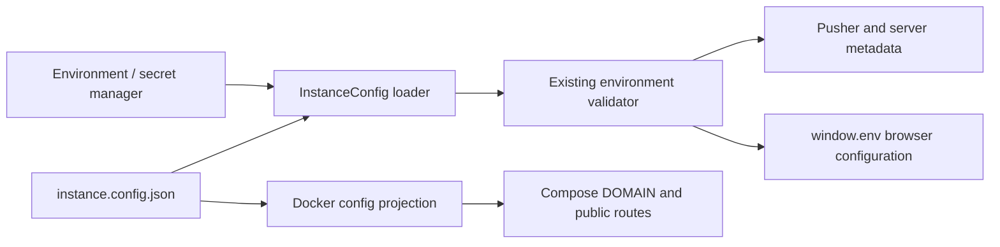

# feat: Add unified instance configuration

## Goal Capsule

- **Objective:** Let a self-hoster change the public origin, product identity, contact details, server presentation, default room, and all replaceable visual assets in one non-secret configuration file.
- **Compatibility:** Existing environment variables remain supported and override file values so current Docker, Railway, and Helm deployments do not break.
- **Boundary:** Secret credentials, database URLs, signing keys, and provider tokens remain environment variables or secret-manager values.
- **Outcome:** A deployment can use an unrelated brand and domain without user-visible Teapot Maps or WorkAdventure defaults leaking from application code.

---

## Problem Frame

Runtime branding is already represented by `BRAND_*` environment variables, but defaults are spread across the environment validator, frontend asset fallbacks, server metadata, Docker templates, Railway templates, and Helm values. Public URLs and callbacks are also repeated. Self-hosters therefore need to coordinate many values and can accidentally retain Teapot-specific names, email, website, images, or hostnames.

## Requirements

- **R1:** Provide one versioned, validated, non-secret instance configuration file covering public origin, brand metadata, contact/support links, server presentation, default room, and replaceable visual assets.
- **R2:** Load the file before environment validation and map it into the existing runtime configuration contract.
- **R3:** Preserve environment-variable overrides for backward compatibility and secrets separation.
- **R4:** Derive same-origin public URLs and callbacks from the configured public origin when explicit overrides are absent.
- **R5:** Remove Teapot-specific application-code fallbacks for website, email, metadata, and replaceable visual assets.
- **R6:** Give Docker self-hosters a deterministic projection from the instance file to Compose variables, without requiring them to duplicate domain and brand values.
- **R7:** Validate unrelated-brand, custom-domain, override-precedence, invalid-file, and missing-file behavior.

---

## Scope Boundaries

### In scope

- The Play/pusher runtime configuration path and browser-injected branding.
- Docker Compose self-hosting configuration and documentation.
- Neutral bundled fallbacks where a visual asset is not configured.
- Generated environment documentation for the new loader variable.

### Deferred to Follow-Up Work

- A room registry with friendly `/rooms/<slug>` routes.
- S3 storage for generated Woka assets.
- Teapot service parity in the Helm chart.
- A full interactive self-hosting CLI beyond configuration validation/projection.

### Out of scope

- Renaming internal `Teapot*` classes, database tables, API routes, or protocol fields.
- Moving secrets into the instance file.
- Supporting arbitrary subpath hosting such as `/game/`.

---

## Key Technical Decisions

- **KTD1 — JSON instance file with a checked-in example.** JSON is dependency-free for the deployment projection script, easy to validate, and usable in containers and PaaS builds.
- **KTD2 — Configuration file supplies defaults; environment wins.** The loader projects file fields onto existing environment keys, then overlays real environment variables. This avoids a second runtime configuration system.
- **KTD3 — One public origin is canonical.** The loader derives same-origin Play, frontend, CORS, map-storage, uploader, icon, MCP, Woka asset, OAuth callback, website, and contact defaults unless a field explicitly chooses another URL.
- **KTD4 — Secrets stay external.** The schema rejects or omits database credentials, signing keys, OAuth secrets, and provider tokens.
- **KTD5 — Fail clearly when explicitly configured.** An invalid or missing file named by `INSTANCE_CONFIG_PATH` is a startup error; deployments that do not set the variable keep the legacy environment-only path.

---

## High-Level Technical Design

Environment values take precedence over the corresponding file fields. Only non-secret operator configuration flows through the file.

---

## Implementation Units

### U1. Define and load the instance configuration contract

**Goal:** Add a validated instance schema and map it to the current environment-variable surface before validation.

**Requirements:** R1, R2, R3, R4

**Dependencies:** None

**Files:**

- `play/src/pusher/config/InstanceConfig.ts`
- `play/src/pusher/enums/EnvironmentVariable.ts`
- `play/src/pusher/enums/EnvironmentVariableValidator.ts`
- `play/tests/pusher/InstanceConfig.test.ts`

**Approach:** Define nested identity, origin, links, server, room, and asset fields. Resolve relative asset paths against the public origin. Project to existing keys, overlay `process.env`, and keep the rest of the runtime unchanged.

**Patterns to follow:** Zod validation and formatted startup failures in `play/src/pusher/enums/EnvironmentVariableValidator.ts` and `play/src/pusher/enums/EnvironmentVariable.ts`.

**Test scenarios:**

1. A complete unrelated-brand file projects the expected name, origin, email, URLs, server metadata, default room, and asset URLs.
2. Environment variables override corresponding file fields.
3. Same-origin service URLs and callbacks derive from `publicOrigin`.
4. A missing explicit file and malformed JSON both return actionable validation errors.
5. With no `INSTANCE_CONFIG_PATH`, legacy environment-only parsing remains unchanged.

**Verification:** Focused tests and Play typecheck pass without changing existing deployment behavior.

### U2. Remove distributed product-identity fallbacks

**Goal:** Ensure user-visible metadata and frontend branding use the unified configuration or neutral assets instead of embedded Teapot-specific website/email strings.

**Requirements:** R1, R5

**Dependencies:** U1

**Files:**

- `play/src/common/FrontConfigurationInterface.ts`
- `play/src/front/Enum/EnvironmentVariable.ts`
- `play/src/front/Branding.ts`
- `play/src/pusher/enums/EnvironmentVariable.ts`
- `play/src/pusher/controllers/FrontController.ts`
- `play/src/pusher/services/LocalAdmin.ts`
- `play/src/pusher/services/MetaTagsBuilder.ts`
- `play/tests/pusher/EnvironmentVariableValidator.test.ts`
- `play/tests/pusher/InstanceConfig.test.ts`

**Approach:** Add contact email to the existing browser configuration contract, derive it from the configured origin only when absent, and replace hardcoded Teapot website/email fallbacks. Retain neutral bundled artwork as the final no-config fallback.

**Test scenarios:**

1. Custom configuration reaches browser metadata and contact helpers.
2. No configured website or email produces a neutral/same-origin result, never a Teapot domain.
3. Manifest/server metadata reflects the custom name, icon, and website.

**Verification:** Existing environment validation and metadata tests pass with updated neutral defaults.

### U3. Add a single-file Docker self-hosting path

**Goal:** Let Docker operators edit one instance file and generate the non-secret Compose environment projection from it.

**Requirements:** R4, R6

**Dependencies:** U1

**Files:**

- `contrib/docker/instance.config.example.json`
- `contrib/docker/instance-config.mjs`
- `contrib/docker/instance-config.test.mjs`
- `contrib/docker/docker-compose.prod.yaml`
- `contrib/docker/docker-compose.teapot.yaml`

**Approach:** Mount the selected instance file read-only into Play and set `INSTANCE_CONFIG_PATH`. The projection utility validates the same operator fields and writes/prints Compose-compatible non-secret variables, especially `DOMAIN`, while secrets remain in a separate restricted env file.

**Test scenarios:**

1. Example configuration validates and emits the expected custom domain and derived URLs.
2. Invalid origins and missing required identity fields fail before Compose startup.
3. The generated environment contains no secret placeholders or secret-valued fields.

**Verification:** Node tests pass and the Compose files resolve with the generated non-secret environment plus the existing secret template.

### U4. Document the canonical configuration and compatibility path

**Goal:** Make the one-file workflow discoverable and remove instructions that require editing identity values in several templates.

**Requirements:** R1, R3, R6

**Dependencies:** U1, U3

**Files:**

- `contrib/docker/README.md`
- `contrib/docker/TEAPOT_BETA_RUNBOOK.md`
- `docs/others/self-hosting/env-variables.md`
- `contrib/tools/generate-env-docs/` outputs as required

**Approach:** Document the instance file as canonical, list environment overrides as compatibility/advanced controls, and make the separation between non-secret instance configuration and secret deployment values explicit.

**Test scenarios:** `Test expectation: none -- documentation reflects the validated contract and generated environment reference.`

**Verification:** Generated environment documentation check passes.

---

## Verification Contract

- Focused unit tests cover file loading, schema validation, URL derivation, and override precedence.
- Existing environment-variable validator and frontend branding tests remain green.
- `play` typecheck, lint, formatting check, and test suite pass.
- Docker projection tests pass with a deliberately unrelated brand/domain.
- Environment documentation remains generated and current.

## Definition of Done

- A self-hoster can edit one non-secret instance file to change domain, brand identity, email/contact, server presentation, default room, and every replaceable brand asset.
- Application code contains no Teapot-specific website or email fallback in the runtime branding path.
- Existing environment-only deployments continue to start and can override any file-derived value.
- Docker documentation provides a one-file configuration workflow with secrets kept separately.
- Relevant automated checks pass and unrelated terrain changes remain untouched.
