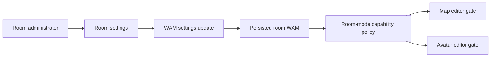

# feat: Add room website mode

## Summary

Add a typed, persisted room mode to the WAM room settings. `website` mode is the first policy: it disables map editing and avatar customization while preserving normal player interaction. The policy is centralized so later modes can add capabilities without proliferating unrelated checks.

## Problem Frame

Rooms currently expose editing controls based on broad editor/login state only. A published room needs to be display-oriented even when a visitor could otherwise open map or avatar editors.

## Requirements

- R1. A room persists an explicit mode setting, defaulting to the existing editable behavior.
- R2. Website mode is configurable by room administrators through the existing room-settings surface and synchronizes to connected clients.
- R3. In website mode, map-editor entry is unavailable and direct client-side entry is rejected.
- R4. In website mode, avatar selection/customization and avatar-generation editing are unavailable.
- R5. Future feature gates derive from the shared room-mode capability policy rather than testing the mode ad hoc.

## Key Technical Decisions

- Store mode in `WAMSettings`, not metadata or a frontend-only flag, because WAM is the room’s validated, persisted, live-synchronized configuration document.
- Model capabilities through a shared helper (`canEditMap`, `canEditAvatar`) whose default preserves current behavior; UI code consumes capabilities, never string-compares modes.
- Extend the existing `UpdateWAMSettings` message/command path for admin edits so the setting is validated and replicated like recording and megaphone settings.

## High-Level Technical Design

## Implementation Units

### U1. Typed mode and capability policy

**Goal:** Define the persisted room mode and its future-facing feature capabilities.

**Requirements:** R1, R5.

**Dependencies:** None.

**Files:** `libs/map-editor/src/types.ts`, `libs/map-editor/src/WAMSettingsUtils.ts`, `libs/map-editor/tests/WAMSettingsUtils.test.ts`.

**Approach:** Add an optional mode setting with editable behavior as the compatibility default. Expose named policy predicates for map and avatar editing.

**Test scenarios:** Existing WAM files with no mode remain editable; website mode denies map and avatar editing; an unsupported mode fails validation.

**Verification:** Shared settings parsing and policy tests pass.

### U2. Persist and synchronize room-mode changes

**Goal:** Carry the setting through the established protobuf and WAM update command flow.

**Requirements:** R1, R2.

**Dependencies:** U1.

**Files:** `messages/protos/messages.proto`, generated message outputs, `libs/map-editor/src/Commands/WAM/UpdateWAMSettingCommand.ts`, `libs/map-editor/tests/Commands/WAM/UpdateWAMSettingCommand.test.ts`.

**Approach:** Add a room-mode settings update variant and route it through the existing command switch, parsing via the shared schema before mutating the WAM document.

**Test scenarios:** Administrator mode update persists the selected mode; undo restores the prior mode; malformed settings are rejected.

**Verification:** Command tests and generated-message typecheck pass.

### U3. Configure and enforce website-mode UI gates

**Goal:** Let an administrator select website mode and use the central policy at all first-party map/avatar editor entry points.

**Requirements:** R2, R3, R4, R5.

**Dependencies:** U1, U2.

**Files:** `play/src/front/Components/MapEditor/ConfigureMyRoom/RoomSettings.svelte`, `play/src/front/Components/ActionBar/MenuIcons/MapEditorMenuItem.svelte`, `play/src/front/Components/Woka/WokaSelectScene.svelte`, map-editor and Woka UI tests.

**Approach:** Add the control to room settings; hide/disable unavailable affordances and guard action handlers so programmatic or stale UI paths cannot activate an editor after the mode changes.

**Test scenarios:** Editable/default rooms retain both controls; website rooms hide map-editor entry; website rooms cannot open avatar customization/generation; changing back to editable restores the controls.

**Verification:** Focused Play Vitest tests, typecheck, and formatting checks pass.

## Scope Boundaries

Website mode does not alter player movement, normal avatar display, room interactions, authentication, or existing map-editor authorization. Server-side edit authorization remains unchanged because this mode is a client-experience/product policy rather than an escalation of user privileges.

### Deferred to Follow-Up Work

- Additional modes and per-feature capabilities beyond map and avatar editing.
- A visitor-facing read-only/website chrome variant.

## Definition of Done

An admin can persist website mode for a room; reloaded and connected clients observe it; map and avatar editing are unavailable in that room; and the feature gates read one shared capability policy with compatibility-safe defaults.
