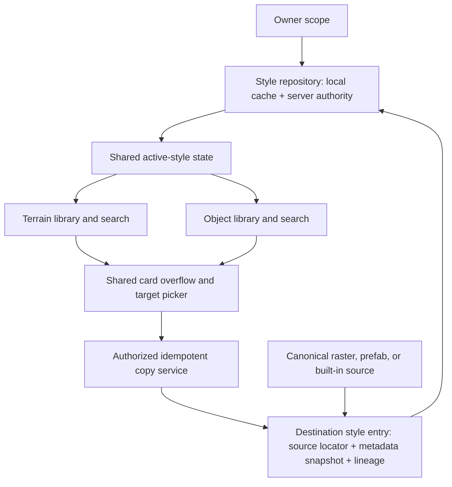
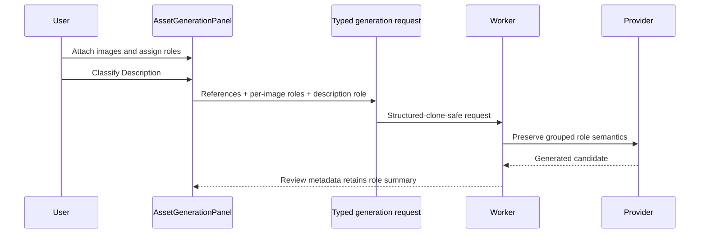

# Map Style Packs - Plan

## Goal Capsule

- **Objective:** Let map creators organize terrain and object assets into named style packs, copy assets between packs without losing search metadata, and tell image-generation providers which text and images define the object versus its style or mood.
- **Authority:** The Product Contract in this plan controls user-visible behavior; Key Technical Decisions control implementation shape; existing ownership, asset-validation, and map-editor contracts remain authoritative where this plan is silent.
- **Execution profile:** Deliver the persistence contracts first, then parallelize style-library UI and generation-role work, and finish with cross-surface integration and migration verification.
- **Stop conditions:** Stop and return to planning if implementation cannot produce stable source identifiers for built-in object or terrain cards, or if the existing authorization model cannot verify the source and destination style under one owner.
- **Tail ownership:** The integration owner reconciles all workstreams, runs the full verification matrix, removes abandoned experiments, and confirms every requirement and acceptance example before declaring completion.

---

## Product Contract

### Summary

Add a persistent `Style` layer above the current Terrain and Objects libraries. A creator can select or create a named style, browse the matching assets, copy any eligible card into another style through an overflow menu, and classify generation guidance as either object-defining or style/mood-defining all the way from the editor to the provider request.

### Problem Frame

The editor currently has useful terrain families, custom tilesets, entity prefabs, generated assets, and reference-image support, but no shared concept that groups those assets into a reusable visual language. “Style” is presently a label in parts of the terrain UI, not a persistent owner-scoped domain object. Terrain and object discovery also use different storage and search metadata, so a UI-only filter would lose information or diverge across tabs.

Image generation has a parallel ambiguity. Every attached image is currently represented as an undifferentiated reference, and the Description prompt has no semantic role. Provider adapters therefore cannot tell whether an input supplies object identity/shape or only aesthetic direction, even if the editor added cosmetic labels.

### Actors

- A1. **Map creator:** Browses terrain and objects, creates styles, copies cards, attaches generation guidance, and searches for copied assets.
- A2. **Authenticated asset owner:** Receives authoritative cross-session style persistence and may manage only their own styles and source assets.
- A3. **Anonymous creator:** Uses a local owner partition for style work until authenticated synchronization is available.
- A4. **Generation provider adapter:** Receives role-preserving guidance and serializes it without collapsing object and style/mood semantics.

### Requirements

**Style catalog and selection**

- R1. Terrain and Objects each show a control labeled `Style` in the asset-library header.
- R2. The selector lists every style available to the active owner and marks the active style by stable ID rather than display name.
- R3. Selecting a style filters the current library to assets assigned to that style without changing the current Terrain or Objects mode.
- R4. The active style selection is shared when moving between Terrain and Objects and is restored after remount or reload when the style still exists.
- R5. A missing or unavailable saved selection falls back to `Default style` with a non-blocking notice.
- R6. The selector includes `New style…`, which opens an inline naming state with Save and Cancel.
- R7. Style names are trimmed, 1–80 characters, and unique case-insensitively within an owner scope; validation or network failure retains the typed value and previous selection.
- R8. A newly created style becomes active immediately and shows a kind-specific empty state with the existing import and generation entry points.
- R9. `Default style` is non-deletable and receives existing owner assets through an idempotent migration or lazy backfill.
- R10. Built-in catalogs remain available in a read-only `Built-in` view and can be copied into a custom style without duplicating bundled image bytes.

**Asset-card copying and findability**

- R11. Every eligible terrain and object card exposes an accessible three-dot overflow action without changing the card’s primary selection behavior.
- R12. The overflow menu contains the exact requested action label `Copy for style`.
- R13. Choosing `Copy for style` transitions the same menu into a target-style picker with Back, Cancel/Escape, and a list of existing styles.
- R14. The current style and styles that already contain the source are disabled and labeled `Already added`; repeated or concurrent copy requests remain idempotent.
- R15. If no eligible destination exists, the target picker offers `Create new style…` and resumes the pending copy after successful creation.
- R16. A successful copy leaves the user in the source style, closes the menu, and confirms `Copied to <style>` with an optional `View` action.
- R17. A failed copy creates no partial style entry, keeps the menu state recoverable, and offers retry without losing the selected target.
- R18. Copying creates a new destination style entry while reusing the canonical raster or object storage where safe.
- R19. The destination entry preserves the complete source metadata inventory: name, description, tags, keywords/search terms, category/type, asset kind, dimensions, grid and animation data, collision and placement data, wall or vegetation profiles, preview metadata, and relevant generation provenance.
- R20. The destination entry receives new identity and audit fields, including its own entry ID, destination style ID, creation timestamp, and source lineage such as `derivedFromAssetId`.
- R21. Searching the destination style by any preserved source keyword returns the copied asset for both terrain and object flows.
- R22. The server resolves and authorizes the source asset itself; clients cannot manufacture a copy by submitting arbitrary URLs, owner IDs, or metadata.

**Object and style/mood generation guidance**

- R23. Attaching an image through the AI reference upload or drop target requires a role: `Object reference` or `Style / mood guide`.
- R24. A batch attachment may receive a batch default, but every thumbnail shows its role and permits an individual override before generation.
- R25. Newly attached images default to `Object reference`; a future entry point explicitly invoked as “make in this style” may preselect `Style / mood guide`.
- R26. The current Description text area gains the paired semantic switcher `Object` / `Style / mood`, defaulting to `Object`.
- R27. Generation remains disabled while an attachment is unclassified, and the review state summarizes object-reference and style-guide counts.
- R28. `AssetGenerationRequest` carries the role of every image and the role of the Description block through session state, worker transport, approval metadata, retry, and provider dispatch.
- R29. Every provider adapter serializes explicit role instructions adjacent to or unambiguously associated with the corresponding image; image ordering alone is insufficient.
- R30. Object references may influence subject identity, silhouette, geometry, and content; style/mood guides may influence palette, texture, rendering language, atmosphere, and mood without silently replacing the requested object.
- R31. Provider capability limits, normalization, MIME validation, cancellation, retry, and object-URL cleanup continue to apply equally to both roles.

**Compatibility, ownership, and usability**

- R32. Style is orthogonal to the existing asset kind; it must not be encoded as a new generated-asset kind or conflated with AI provider/model settings.
- R33. Style list, create, and copy APIs enforce the existing owner and `asset.create` / `asset.manage-own` capability boundaries.
- R34. Anonymous style records and entries remain partitioned from authenticated owner records; the UI must never expose one owner’s styles to another owner.
- R35. Existing terrain painting, object selection, direct image import, object editing, generated-asset approval, and built-in catalog behavior remain usable when no custom style action is taken.
- R36. The selector, overflow menu, nested target picker, role chooser, and role switcher support keyboard operation, visible focus, screen-reader names, Escape/Back behavior, and focus return to the invoking control.
- R37. All new user-facing copy is translated through the existing map-editor i18n structure.

### Key Flows

- F1. **Browse a style across asset kinds**
  - **Trigger:** A1 opens Terrain or Objects.
  - **Steps:** Load owner styles; restore or select the active style; resolve style entries for the current kind; apply the existing kind-specific search.
  - **Outcome:** The library shows only matching cards, and the same style remains selected when the creator changes asset kind.
- F2. **Create a style**
  - **Trigger:** A1 selects `New style…`.
  - **Steps:** Enter a name; validate locally; submit under the active owner; reconcile the authoritative record; select it.
  - **Outcome:** A named empty style is available in both Terrain and Objects without disturbing existing assets.
- F3. **Copy a card into a style**
  - **Trigger:** A1 opens a card’s overflow menu and selects `Copy for style`.
  - **Steps:** Choose a destination; resolve and authorize the source; snapshot the metadata clone contract; create an idempotent destination entry pointing at reusable storage.
  - **Outcome:** The source remains unchanged and the destination card is independently searchable by the same terms.
- F4. **Attach and classify generation images**
  - **Trigger:** A1 drops or picks one or more images in the AI reference field.
  - **Steps:** Normalize each image; assign or override its role; show the role on its thumbnail; block submission until all inputs are classified.
  - **Outcome:** The editor holds an explicit, inspectable split between object references and style/mood guides.
- F5. **Classify description and generate**
  - **Trigger:** A1 writes the Description and chooses `Object` or `Style / mood`.
  - **Steps:** Build the typed request; preserve roles through the worker; serialize deterministic provider guidance; review and accept or reject the result.
  - **Outcome:** A4 receives the intended semantics without relying on image order or UI-only state.
- F6. **Recover from failure or stale state**
  - **Trigger:** A style disappears, a create/copy call fails, the session expires, or concurrent work repeats an operation.
  - **Steps:** Preserve local form/menu state; fall back only when required; retry idempotently; reconcile by stable IDs.
  - **Outcome:** No partial membership, cross-owner leak, duplicate destination entry, or lost attachment classification remains.

### Acceptance Examples

- AE1. Given an owner with `Default style`, when they create `Watercolor village` from Terrain, then the new style is selected, shows an empty terrain state, and remains selected after switching to Objects.
- AE2. Given `Watercolor village` already exists, when another style is submitted as ` watercolor VILLAGE `, then the server reports a name conflict and the naming form keeps the entered value.
- AE3. Given a card tagged `tree`, `oak`, and `forest` in `Default style`, when the creator chooses `Copy for style` and targets `Watercolor village`, then searching `oak` in the destination returns the copy with the same dimensions, rendering metadata, and tags.
- AE4. Given an identical raster is copied into two styles, when persistence completes, then the styles have distinct logical entries and lineage while the stored bytes remain deduplicated.
- AE5. Given a built-in terrain or object card, when it is copied into a custom style, then the destination resolves the bundled source through a stable key and no bundled file is duplicated.
- AE6. Given a creator tries to copy another owner’s asset or target another owner’s style, when the request reaches the server, then it is rejected without disclosing private metadata or creating an entry.
- AE7. Given one object photo and one mood board are dropped together, when the batch default is `Object reference` and the mood board is overridden to `Style / mood guide`, then the request preserves the two distinct roles.
- AE8. Given the Description is marked `Style / mood`, when a tree object reference is also attached, then the provider instructions preserve the tree as the subject and apply the text only as aesthetic direction.
- AE9. Given an attachment has not received a role, when the creator attempts generation, then submission remains disabled and the unclassified thumbnail is identified.
- AE10. Given a copy request commits but its response is lost, when the client retries, then the same destination entry is returned and no duplicate is created.

### Success Criteria

- A creator can establish a named visual asset collection once and browse it consistently from both Terrain and Objects.
- A copied card is discoverable in its destination by every source search term and retains all behavior-affecting metadata.
- Mixed object and style/mood guidance produces a typed request whose semantics survive every local and provider boundary.
- Existing unstyled assets remain visible under `Default style`, and existing editor workflows regress neither functionally nor accessibly.

### Scope Boundaries

**Included**

- Personal style creation, selection, persistence, and kind-specific filtering.
- Copying built-in and owner-controlled terrain/object cards into custom styles.
- One classified Description block plus any number of classified image references within existing provider limits.
- Local anonymous partitions and authoritative authenticated persistence using existing asset-sync conventions.

#### Deferred to Follow-Up Work

- Style rename, delete, reorder, sharing, team/workspace ownership, export/import, publishing, and marketplace behavior.
- Supplying simultaneous separate Object text and Style/mood text blocks in one request.
- Automatically attaching every prior style guide in a pack to new generation requests.
- Batch-copying whole styles, merging styles, or detecting aesthetic similarity.
- Editing a destination copy and selectively propagating later metadata changes from its source.

**Outside this product’s identity**

- Treating style packs as AI model/provider presets.
- Duplicating bundled or generated raster bytes solely to express style membership.
- Allowing cross-owner copy by accepting unverified client metadata or public URLs.

---

## Planning Contract

### Key Technical Decisions

- KTD1. **A style is one owner-scoped identity spanning Terrain and Objects.** Asset kind remains a filter inside the style, which keeps both switchers coherent and avoids two unrelated “style” concepts.
- KTD2. **Use a dedicated style record plus logical style-entry records.** A style entry references a stable source asset, snapshots the copy contract, and owns destination identity; it does not mutate the source or encode style as an asset kind.
- KTD3. **Reuse canonical storage while cloning logical metadata.** The entry model avoids the current SHA-256 upload dedupe conflict, supports built-in stable keys, and gives each destination independent search and lineage without copying bytes.
- KTD4. **Keep a versioned metadata clone inventory per asset kind.** A shared envelope covers discovery and provenance, while terrain, tileset, entity, wall, vegetation, grid, animation, collision, and placement fields are validated by kind-specific schemas.
- KTD5. **Backfill to a non-deletable Default style.** Existing assets remain discoverable without requiring a destructive migration or changing existing raster/object references.
- KTD6. **Use local-first client state with authenticated server authority.** Anonymous data stays in an isolated local scope; authenticated creation/copy synchronizes to server IDs and never merges owner scopes implicitly.
- KTD7. **Make create and copy idempotent at the data boundary.** Normalized owner/name uniqueness prevents duplicate styles, and destination/source uniqueness or an idempotency key prevents duplicate entries after retry or concurrency.
- KTD8. **Introduce reusable style UI primitives.** One switcher/create component and one accessible card action/target picker are integrated into both libraries instead of duplicating menu state machines.
- KTD9. **Roles are typed request data, not prompt-only decoration.** `AssetGenerationReference` and the Description guidance block carry enum roles through normalization, session, worker, approval, retry, and provider code.
- KTD10. **Provider prompts group inputs explicitly by role.** Adapters construct deterministic object-reference and style/mood sections and associate each instruction with its image; transport-specific APIs may add richer fields but cannot drop the shared role contract.
- KTD11. **The requested “hex description” maps to the current Description field.** No separate hex-description control exists in the inspected editor; implementation adds the Object / Style / mood selector beside the existing Description input unless a newly discovered control supersedes it.
- KTD12. **Do not widen protobuf contracts unless the style entry cannot carry object semantics.** Existing `EntityPrefab.tags` and upload metadata already preserve object discovery; protobuf changes require separate evidence that the server boundary cannot represent the clone contract.
- KTD13. **Make source identity discriminated and versioned.** Every locator includes source type, canonical key, source version, and asset kind; persisted sources use foreign keys where possible, and built-ins use allowlisted versioned keys rather than mutable URLs.
- KTD14. **Authorize, snapshot, retain storage, and insert in one transaction.** Copy either commits one entry whose source state and owner were authorized together or commits nothing; source deletion uses tombstones or reference counts so a destination never loses referenced bytes.
- KTD15. **Classify metadata by trust before cloning or prompting.** Only validated discovery and rendering fields are cloneable. Owner, capability, storage locator, lineage, timestamps, moderation/internal state, and destination identity are server-owned; provider payloads receive guidance content and validated roles but never internal locators or ownership metadata.

### High-Level Technical Design

### Data Contracts

| Contract | Required fields | Invariants |
| --- | --- | --- |
| Style | ID, owner scope, display name, normalized name, timestamps, default/built-in flags | Owner/name uniqueness; stable ID; Default is non-deletable |
| Style entry | ID, style ID, asset kind, source type/key, metadata version, metadata snapshot, lineage, timestamps | Source and destination owner authorized; unique logical membership; source bytes reused |
| Shared metadata envelope | Name, description, tags, keywords/search terms, category/type, preview, provenance | Preserved exactly on copy except explicitly regenerated identity/audit fields |
| Kind metadata | Dimensions, tile/grid, animation, collision, placement, wall/vegetation, terrain/surface fields as applicable | Validated by asset kind; unsupported fields rejected rather than silently dropped |
| Guidance reference | ID, blob, MIME type, role | Role is `object-reference` or `style-mood-guide`; never absent at dispatch |
| Description guidance | Text, role | Role is `object` or `style-mood`; one block in this scope |

### Assumptions

- Styles are personal and reusable across maps, not owned by one map or room.
- One style identity contains both terrain and object entries; each library filters that shared identity by asset kind.
- Built-in cards may be copied into custom styles through stable source references.
- Anonymous users receive local-only styles, while authenticated users receive authoritative remote persistence and cross-session hydration; anonymous records remain in their partition unless a future explicit import flow moves them.
- Copy produces an independent logical style entry backed by shared source storage, not another mutable alias of the source metadata.
- The user’s “hex description” phrase refers to the existing Description prompt field because no distinct hex-description field exists in the current feature surface.

### System-Wide Impact

- **Persistence:** Adds owner-scoped styles and heterogeneous style entries across in-memory and PostgreSQL repositories, plus client hydration and local cache reconciliation. Copied snapshots and referenced binary/versioned built-in sources must outlive source edits or deletion.
- **Authorization:** Every read, create, and copy path derives owner scope from the trusted session, rechecks source/destination/capability inside the mutation transaction, and uses non-enumerating failures. Built-in locators resolve only through a server-owned allowlist.
- **Search:** Terrain and objects retain separate search engines, but both consume the same metadata snapshot contract so copied keywords remain equivalent.
- **Generation:** A shared request type changes every worker and provider implementation; missing one adapter would silently erase role semantics.
- **External prompt boundary:** Descriptions, filenames, and copied keywords remain untrusted content delimited from provider instructions. Internal owner IDs, source locators, lineage, local paths, and unrelated metadata never enter provider payloads.
- **Map editor:** Shared active-style state crosses the Terrain/Object boundary, while direct painting, placement, uploads, and editing remain kind-specific.
- **Accessibility and i18n:** New nested menus and role controls add focus management and translatable strings across shared and kind-specific components.

### Risks and Mitigations

| Risk | Mitigation |
| --- | --- |
| Existing SHA dedupe collapses copies | Store independent style entries that reuse source storage instead of re-uploading identical bytes |
| Built-in sources lack server-owned asset rows | Define allowlisted stable source locators and resolver tests before enabling copy for that source type |
| “All metadata” drifts as schemas evolve | Version the clone envelope, inventory fields by kind, and add round-trip/field-completeness fixtures |
| One provider loses guidance roles | Update every provider and worker boundary in one contract unit; require mixed-role tests per provider |
| Terrain and object search diverge | Assert the same source keywords before and after copy in both library test suites |
| Anonymous/authenticated records leak across scopes | Partition by owner scope, never merge implicitly, and test account switching and logout |
| Nested card menu harms selection or keyboard behavior | Keep overflow events isolated from card selection and cover focus, Escape, Back, and outside-click behavior |
| Default-style migration hides existing assets | Make backfill idempotent, preserve old list behavior until reconciliation succeeds, and verify populated accounts |
| Concurrent initialization creates multiple Defaults | Mark Default structurally, reserve its normalized name, and enforce exactly one system style per owner in the database |
| Source locator collisions or built-in key drift | Use a discriminated, versioned canonical locator and make retired resolvers read-only without deleting lineage or snapshots |
| Source deletion strands destination copies | Retain referenced storage through tombstones/reference counts and keep immutable snapshots plus content hashes |
| Metadata schema evolution drops new fields | Version snapshots, dual-read supported versions, use upgrade adapters, and reject or losslessly retain unknown fields |
| Partial backfill switches an owner too early | Use expand–backfill–verify–switch with per-owner/kind checkpoints, count/checksum reconciliation, and a legacy-read rollback window |
| Account switching applies stale async results | Scope cache keys and request epochs by identity, journal pending mutations, and discard responses whose initiating scope is no longer active |
| Locator probing reveals another owner’s assets | Return non-enumerating authorization failures and keep locator, owner, kind, metadata, and deletion state out of client errors and logs |
| Built-in locator enables URL/path resolution abuse | Accept opaque typed keys only and resolve them through an immutable server catalog; never treat request URLs, paths, aliases, redirects, or schemes as authority |
| Metadata clone crosses trust classes | Allowlist cloneable discovery/rendering schemas and regenerate server-owned identity, owner, locator, lineage, audit, moderation, and capability fields |
| Guidance text injects provider instructions or leaks internals | Delimit untrusted content, let enums control role behavior, and omit internal identifiers and unrelated metadata from outbound payloads |

### Phased Sub-Agent Delivery

| Phase | Owner | Deliverable | Starts after | Handoff evidence |
| --- | --- | --- | --- | --- |
| 1 | **Sub-agent A — Style data/API** | U1–U2: migration, repositories, service/API, local sync, ownership and idempotency tests | Immediately | Versioned contracts and focused persistence/API tests green |
| 2A | **Sub-agent B — Shared style UX + Terrain** | U3–U4: active state, selector/create, accessible menu primitives, terrain filtering/copy/search | U1 contract shape is stable; may mock U2 API | Component tests plus a demo fixture for Default, Built-in, empty, and copied states |
| 2B | **Sub-agent C — Objects + metadata clone** | U5: object cards, picker, full prefab metadata bridge, object search and copy behavior | U1 clone contract and U3 primitives | Object copy fixture proves tags and render/placement fields survive |
| 2C | **Sub-agent D — Generation roles** | U6–U7: role chooser, typed request, worker/provider propagation, mixed-role prompt tests | Role enums agreed between U6 and U7; otherwise parallel after the shared contract freeze | Request snapshots and every provider test prove roles survive |
| 3 | **Sub-agent E — Integration and migration** | U8: cross-surface E2E, legacy/default backfill, owner isolation, regression matrix, docs | U2, U4, U5, U7 | Full verification contract, acceptance trace, and no unresolved contract drift |

Sub-agents B–D work in parallel after the small shared contracts are frozen. Sub-agent E owns integration conflicts rather than asking feature agents to make incompatible local fixes. Each handoff includes changed contract notes, focused test evidence, remaining assumptions, and any fixture/schema version updates.

### Sequencing

1. Freeze the style, style-entry, metadata-clone, and guidance-role contracts.
2. Land server persistence/API and client repository behavior before production UI calls it.
3. Build shared style UI primitives, then integrate Terrain and Objects in parallel where file ownership does not overlap.
4. Build guidance-role UI and request propagation in parallel with style-library work.
5. Reconcile the object/terrain clone fixtures, backfill existing assets, and run cross-surface integration verification.

### Operational and Rollout Notes

- Deploy the schema additively, then ship code that can dual-read legacy catalogs and style entries before beginning backfill.
- Create each owner’s Default through an atomic structural get-or-create path. A partial uniqueness constraint permits exactly one `is_default` style per owner, and the normalized Default name is reserved from user creation.
- Backfill in bounded per-owner/kind transactions with durable checkpoints. Do not switch an owner to style-only reads until eligible-source counts and metadata checksums match Default-entry counts.
- Keep legacy read compatibility and source data for at least one rollback window. Rollback disables the style-only read path but does not drop style rows, snapshots, lineage, or retained source storage.
- Treat metadata snapshot versions as a reader-compatibility contract: the initial release never destructively rewrites old snapshots, and new writers remain readable by the rollback version.
- Abort rollout on any cross-owner/wrong-kind link, duplicate Default, dangling source/storage reference, or owner/kind reconciliation mismatch. Resume only after repairing the affected partition and rerunning verification.
- Record aggregate migration/copy failure counts and integrity mismatches without logging private prompts, reference images, arbitrary metadata values, or signed asset URLs.
- Security rollout evidence must include HTTP-boundary negative tests for non-enumeration, source allowlisting, transactional reauthorization, clone-field trust, and provider payload minimization.

---

## Implementation Units

### U1. Define style persistence and the metadata clone contract

- **Goal:** Add owner-scoped style and style-entry records that can represent built-in and persisted terrain/object sources without duplicating binary storage.
- **Requirements:** R7, R9–R10, R18–R22, R32–R34; AE2–AE6, AE10.
- **Dependencies:** None.
- **Files:** `play/src/pusher/teapot/migrations/0010_teapot_map_styles.sql`, `play/src/pusher/teapot/TeapotRecords.ts`, `play/src/pusher/teapot/TeapotDataRepository.ts`, `play/src/pusher/teapot/InMemoryTeapotDataRepository.ts`, `play/src/pusher/teapot/PostgresTeapotDataRepository.ts`, `play/tests/pusher/TeapotDataFoundation.test.ts`, `play/tests/pusher/PostgresTeapotAuthoringRepository.test.ts`.
- **Approach:** Create styles and versioned style-entry metadata snapshots with structural Default identity, owner/name constraints, and destination/canonical-source uniqueness. Represent each locator as source type, canonical key, source version, and asset kind; use foreign keys for persisted sources and opaque allowlisted versioned keys for built-ins. The server-owned resolver never interprets request text as a URL, path, alias, redirect, or runtime fetch target. Authorize and version-check the source, capture only cloneable fields, retain source storage, regenerate trusted fields, and insert lineage in one transaction. Add upgrade readers for every supported snapshot version and keep style orthogonal to current asset kinds.
- **Execution note:** Start with repository contract and migration tests, including populated legacy fixtures, before implementing the services that depend on them.
- **Patterns to follow:** Existing migration runner and `teapot_asset_catalogs` / `teapot_catalog_assets` ownership patterns; repository parity across in-memory and PostgreSQL implementations; `TeapotGeneratedAssetService` fingerprint handling.
- **Test scenarios:**
  1. Create two differently named styles for one owner and list them in stable order with Default first.
  2. Reject trimmed-empty, overlong, and case-insensitive duplicate names without creating rows.
  3. Permit the same normalized style name for two different owners without cross-list leakage.
  4. Backfill existing asset records into exactly one Default style entry per source after repeated migration/reconciliation runs.
  5. Create a destination entry that preserves every shared and kind-specific fixture field while assigning new identity, timestamp, destination, and lineage.
  6. Copy identical source storage into two styles and verify distinct logical entries share the canonical source reference.
  7. Reject an unknown, malformed, deleted, or cross-owner source locator and roll back the entire copy.
  8. Retry a committed copy with the same destination/source and return the existing entry.
  9. Represent an allowlisted built-in source key without creating or copying a binary asset row.
  10. Race two Default initializations and two same-name style creates and commit one structurally valid record per owner.
  11. Copy, then edit or delete the source and retire a built-in fixture; verify the destination snapshot and retained bytes remain usable.
  12. Read every supported metadata version, round-trip unknown/future fields according to policy, and fail explicitly when no compatible reader exists.
  13. Race source deletion, metadata update, ownership change, and destination deletion against copy and commit either one authorized snapshot or nothing.
  14. Reject traversal, encoded traversal, URL schemes, alternate normalization, redirects, unknown namespaces, and valid-looking non-allowlisted built-in keys without filesystem or network resolution.
  15. Feed poisoned metadata containing forged owner/lineage/locator/internal flags and arbitrary URLs; preserve approved search/render fields while regenerating or rejecting every trusted field.
- **Verification:** Both repository implementations satisfy the same style contract, the migration is idempotent on empty and populated databases, and metadata fixtures round-trip without silent field loss.

### U2. Expose authorized style services, APIs, and local synchronization

- **Goal:** Provide style list/create/filter/copy operations to the browser with owner isolation, local anonymous partitions, and authenticated reconciliation.
- **Requirements:** R2–R9, R14–R18, R22, R33–R35; AE1–AE3, AE6, AE10.
- **Dependencies:** U1.
- **Files:** `play/src/pusher/teapot/TeapotMapStyleService.ts`, `play/src/pusher/controllers/TeapotMapStyleController.ts`, `play/src/pusher/teapot/createTeapotDataServices.ts`, `play/src/pusher/teapot/TeapotDataRuntime.ts`, `play/src/front/Services/TeapotMapStyleApi.ts`, `play/src/front/Services/MapStyleLocalStore.ts`, `play/src/front/Services/MapStyleController.ts`, `play/tests/pusher/TeapotAuthoringRoutes.test.ts`, `play/tests/pusher/TeapotDataRuntime.test.ts`, `play/tests/front/Services/TeapotMapStyleApi.test.ts`, `play/tests/front/Services/MapStyleLocalStore.test.ts`, `play/tests/front/Services/MapStyleController.test.ts`.
- **Approach:** Resolve owner and capability server-side, validate typed request/response schemas, and expose authoritative style and entry views. Mirror `GeneratedMapAssetController` local-first hydration with composite scope keys, request epochs, pending-mutation journaling, and atomic temporary-to-server ID mapping. Create and copy carry durable owner-scoped idempotency keys so lost responses replay the committed result. Never accept owner IDs, metadata snapshots, or arbitrary URLs as copy authority from the browser.
- **Patterns to follow:** `TeapotGeneratedAssetController`, `TeapotGeneratedAssetService`, `TeapotGeneratedAssetApi`, `GeneratedAssetLocalStore`, `GeneratedMapAssetController`, and `TeapotOwnerIdentityResolver`.
- **Test scenarios:**
  1. List only the active owner’s styles and entries and reject unauthenticated server mutations.
  2. Create a valid style, validate the response schema, cache it, and select the server-reconciled stable ID.
  3. Preserve the typed name and prior style when create returns a conflict or transient error.
  4. Copy through source and destination IDs only; verify the service resolves and clones authoritative metadata.
  5. Lose a successful response, retry, and reconcile one destination entry.
  6. Render cached styles while remote hydration is pending or fails, with errors scoped to synchronization rather than disabling local browse.
  7. Switch anonymous → account A → account B and verify every style partition remains isolated.
  8. Cancel hydration or unmount without leaking requests, subscriptions, or object URLs.
  9. Switch anonymous → account A → account B while responses complete out of order and verify each result mutates only its initiating scope.
  10. Reload between server commit and cache reconciliation, replay the mutation key, and converge on one server row, one cache row, and one selected stable ID.
  11. Probe unknown, deleted, cross-owner, wrong-kind, and unauthorized built-in sources/destinations and receive a non-disclosing failure shape with no mutation or sensitive log/client metadata.
  12. Log out or switch accounts while list/create/copy responses are in flight and verify late data, names, errors, and selections never render in or persist to the new scope.
- **Verification:** The client can create, hydrate, filter, and copy with deterministic retry behavior; server tests prove capability and owner boundaries; local failures do not corrupt readable styles.

### U3. Build shared style selection, creation, and card-action primitives

- **Goal:** Create reusable Svelte 5 controls for the shared Style selector, inline naming state, card overflow menu, and target-style picker.
- **Requirements:** R1–R8, R11–R17, R36–R37; AE1–AE3.
- **Dependencies:** U2 contract shape; implementation may begin against a typed mock after U1.
- **Files:** `play/src/front/Components/MapEditor/StylePacks/StylePackSwitcher.svelte`, `play/src/front/Components/MapEditor/StylePacks/StylePackCardMenu.svelte`, `play/src/front/Stores/MapEditorStyleStore.ts`, `play/src/i18n/en-US/mapEditor.ts`, `play/tests/front/Components/MapEditor/StylePackSwitcher.test.ts`, `play/tests/front/Components/MapEditor/StylePackCardMenu.test.ts`, `play/tests/front/Stores/MapEditorStyleStore.test.ts`.
- **Approach:** Centralize active-style restoration and fallback in a store; keep create state inside the selector; implement the two-state overflow menu as one focus-managed component. Expose source kind/key and already-present style IDs through typed props, stop menu clicks from selecting cards, and return focus after close. Use `Copy for style` exactly as requested.
- **Patterns to follow:** Svelte 5 runes and cleanup rules in `play/AGENTS.md`, neighboring map-editor translations, `EntityEditorTabs.svelte` selection semantics, and existing native button/`aria-pressed` patterns.
- **Test scenarios:**
  1. Render Default first, sort other styles deterministically, and select by stable ID.
  2. Restore a valid ID and fall back with notice when that ID is absent.
  3. Open `New style…`, cancel without changing selection, and retain text after validation failure.
  4. Submit a valid style, reconcile its ID, close the form, and select it.
  5. Open the three-dot button without triggering the card’s primary action.
  6. Move from `Copy for style` to the target list, disable current/existing destinations, return with Back, and dismiss with Escape/outside click.
  7. Create a destination from the empty target state and resume the pending copy.
  8. Navigate every control by keyboard and verify accessible names, focus visibility, and focus return.
- **Verification:** The components operate against typed mock data, do not own terrain/object business logic, and pass accessibility-focused component tests.

### U4. Integrate style packs with the Terrain library

- **Goal:** Filter built-in, saved tileset, generated surface, and vegetation terrain cards by active style and support metadata-complete copy/search.
- **Requirements:** R1–R5, R8–R21, R35–R37; AE1, AE3–AE5, AE10.
- **Dependencies:** U2, U3.
- **Files:** `play/src/front/Components/MapEditor/FloorEditor/FloorEditor.svelte`, `play/src/front/Services/BuiltInTerrainCatalog.ts`, `play/src/common/Teapot/CraftpixSummerTerrainCatalog.ts`, `play/src/front/Phaser/Game/MapEditor/Tools/FloorEditorCatalog.ts`, `play/src/front/Services/TeapotTilesetApi.ts`, `play/tests/front/Components/MapEditor/FloorEditor/FloorEditorModes.test.ts`, `play/tests/front/Phaser/Game/MapEditor/BuiltInTerrainCatalog.test.ts`, `play/tests/front/Phaser/Game/MapEditor/TerrainSurfaceCatalog.test.ts`, `play/tests/front/Services/TeapotTilesetApi.test.ts`.
- **Approach:** Place the shared selector above terrain search, resolve style entries into existing card models, and keep Built-in as a read-only source view. Feed copied metadata into the current normalized terrain search haystack, retain shape/brush capabilities and provenance, and attach the shared card menu without altering paint selection. Existing upload and generation acceptance assigns the active style or Default when no custom style is selected.
- **Patterns to follow:** Current `FloorEditor.svelte` family grouping, `searchBuiltInTerrainAssets`, `TerrainSurfaceCatalog` search normalization, `selectLibraryBrush`, and existing tileset API provenance.
- **Test scenarios:**
  1. Switch styles and show only terrain entries for the active style without resetting current floor-editor mode.
  2. Switch to Objects and back and retain the selected style.
  3. Show kind-specific empty state while keeping Add asset and generation actions usable.
  4. Copy a built-in terrain card and preserve name, description, tags/search terms, terrain type, grid, collision/traversal, and shape controls.
  5. Copy a generated terrain surface or vegetation asset and preserve dimensions, surface grid, animation, provenance, and effects.
  6. Search every original keyword in the destination and return the copied card.
  7. Repeated copy reports Already added and never creates a duplicate.
  8. Existing Craftpix, LPC, legacy tilesheet, upload, brush, and shape flows behave unchanged in Built-in/Default.
- **Verification:** Terrain component, catalog, API, and rendering tests prove style filtering and copy behavior without regressing painting or built-in discovery.

### U5. Integrate style packs with the Objects library and prefab metadata

- **Goal:** Add style selection and copy actions to object cards while preserving full custom-prefab discovery and placement semantics.
- **Requirements:** R1–R5, R8–R22, R35–R37; AE1, AE3–AE6, AE10.
- **Dependencies:** U2, U3.
- **Files:** `play/src/front/Components/MapEditor/EntityEditor/EntityEditorPicker.svelte`, `play/src/front/Components/MapEditor/EntityEditor/EntitiesGrid.svelte`, `play/src/front/Components/MapEditor/EntityEditor/EntityItem/EntityItem.svelte`, `play/src/front/Components/MapEditor/EntityEditor/EntityUpload/EntityUpload.svelte`, `play/src/front/Phaser/Game/MapEditor/EntitiesCollectionsManager.ts`, `play/src/front/Stores/MapEditorEntityUploadDraftStore.ts`, `libs/map-editor/src/types.ts`, `map-storage/src/Services/CustomEntityCollectionService.ts`, `play/tests/front/Components/MapEditor/EntityAssetSelection.test.ts`, `play/tests/front/Phaser/Game/EntitiesCollectionsManager.test.ts`, `play/tests/front/Stores/MapEditorEntityUploadDraftStore.test.ts`, `map-storage/src/Services/tests/CustomEntityCollectionService.test.ts`.
- **Approach:** Integrate the shared selector into the picker and the shared overflow control into object cards. Resolve style-entry snapshots into complete prefabs rather than reconstructing from bytes, preserving collection/entity tags, dimensions, collision, depth, default size, animation, wall and vegetation profiles. Keep primary card selection and Custom Entity editing unchanged; new accepted imports inherit active style or Default.
- **Patterns to follow:** Existing category/name/tag filtering in `EntitiesCollectionsManager`, “Save as custom” cloning in `EntityEditorPicker.svelte`, upload-draft tag preservation, and `EntityPrefab` validation in `libs/map-editor/src/types.ts`.
- **Test scenarios:**
  1. Filter object cards by active style while retaining category and text search inside that style.
  2. Copy a built-in object into a custom style and place it without duplicating bundled bytes.
  3. Copy a custom object and preserve name, tags, size, depth, collision mask, animation, wall/vegetation fields, and preview metadata.
  4. Search the destination by every source tag and category/name term.
  5. Open the overflow menu without arming or placing the source asset.
  6. Edit or delete the destination entry without mutating the source style entry or canonical source asset contrary to lineage rules.
  7. Reject cross-owner and deleted source copies before any room-prefab mutation.
  8. Existing direct upload, generated acceptance, custom editing, selection outline, and placement behavior remain unchanged.
- **Verification:** Object UI, collection manager, draft-store, map-editor schema, and map-storage tests demonstrate field-complete cloning and unchanged placement behavior.

### U6. Add per-image and Description guidance-role controls

- **Goal:** Make Object versus Style/mood intent explicit and editable for every generation input before submission.
- **Requirements:** R23–R27, R31, R35–R37; AE7–AE9.
- **Dependencies:** None; coordinate enum names with U7.
- **Files:** `play/src/front/Components/AssetGeneration/AssetGenerationPanel.svelte`, `play/src/front/Services/AssetGeneration/ReferenceImageNormalizer.ts`, `play/src/front/Components/MapEditor/EntityEditor/EntityUpload/EntityUpload.svelte`, `play/src/front/Components/MapEditor/FloorEditor/TerrainSurfaceAssetEditor.svelte`, `play/src/i18n/en-US/mapEditor.ts`, `play/tests/front/Components/AssetGeneration/AssetGenerationPanel.test.ts`, `play/tests/front/Services/AssetGeneration/ReferenceImageNormalizer.test.ts`, `play/tests/front/Components/MapEditor/FloorEditor/FloorEditorModes.test.ts`.
- **Approach:** Extend the ephemeral reference collection to retain a role beside normalized blob data. After pick/drop, collect a batch default and show per-thumbnail role controls. Add an Object / Style / mood segmented control beside the existing Description input, include role counts in review, and block generation only when required input is unclassified or otherwise invalid. Re-enable reference controls for the compact environment-object editor where necessary without restoring removed decorative chrome.
- **Patterns to follow:** Existing reference normalization/caps, `AssetGenerationPanel` lifecycle, `EntityEditorTabs.svelte` semantics for compact toggles, and component cleanup for object URLs and listeners.
- **Test scenarios:**
  1. Add one image, accept the Object reference default, and show the role on its preview.
  2. Add a batch, apply one default, override one thumbnail to Style / mood guide, and retain both roles through rerender.
  3. Remove or replace one reference and revoke only the correct object URL while preserving sibling roles.
  4. Toggle Description from Object to Style / mood without altering its text.
  5. Block generation for an unclassified attachment and identify that thumbnail accessibly.
  6. Show mixed-role counts in review and preserve roles on retry/revision.
  7. Preserve MIME rejection, image normalization, maximum-count/size behavior, cancellation, and compact map-object layout.
- **Verification:** Component and normalizer tests prove role assignment, editing, validation, accessibility, and cleanup without provider involvement.

### U7. Preserve guidance roles through workers and every provider

- **Goal:** Carry typed image and Description roles through the complete generation pipeline and serialize deterministic provider instructions.
- **Requirements:** R28–R31; AE7–AE9.
- **Dependencies:** U6 enum agreement.
- **Files:** `play/src/front/Services/AssetGeneration/AssetGenerationTypes.ts`, `play/src/front/Services/AssetGeneration/GenerationWorkerProtocol.ts`, `play/src/front/Services/AssetGeneration/GenerationWorkerClient.ts`, `play/src/front/Services/AssetGeneration/GenerationCredentialWorkerRuntime.ts`, `play/src/front/Services/AssetGeneration/OpenRouterImageProvider.ts`, `play/src/front/Services/AssetGeneration/HostedCliImageProvider.ts`, `play/src/front/Services/AssetGeneration/DeterministicFakeImageProvider.ts`, `play/tests/front/Services/AssetGeneration/GenerationCredentialWorkerRuntime.test.ts`, `play/tests/front/Services/AssetGeneration/OpenRouterImageProvider.test.ts`, `play/tests/front/Services/AssetGeneration/HostedCliImageProvider.test.ts`.
- **Approach:** Add structured-clone-safe role enums to references and the Description guidance block. Centralize role-group prompt composition so every provider receives the same semantic contract, then adapt chat/content and dedicated-image transports without relying on ordering. Preserve roles in approval/retry metadata and make test fakes observable enough to detect loss at any boundary.
- **Execution note:** Begin with failing mixed-role contract tests that cross the worker boundary and one real provider adapter, then bring every adapter to parity.
- **Patterns to follow:** Existing `AssetGenerationRequest`, worker protocol, provider prompt builders, staged Woka prompt assertions, and fake-provider request capture.
- **Test scenarios:**
  1. Structured-clone a request with mixed image roles and a Style/mood Description and receive identical roles in the worker runtime.
  2. Serialize object references with subject/geometry instructions and style guides with aesthetic-only instructions adjacent to the correct images.
  3. Cover both OpenRouter chat/content and dedicated image-generation transports.
  4. Send the same typed semantics through Hosted CLI and the deterministic fake provider.
  5. Generate with only object guidance, only style guidance, mixed guidance, and no images while retaining the Description role.
  6. Retry/revise an approved candidate and preserve the role summary rather than reverting to undifferentiated references.
  7. Reject impossible/missing role values at the earliest validation boundary.
  8. Send instruction-like descriptions, filenames, and copied keywords with reordered attachments; verify validated role grouping remains authoritative and prompt text remains delimited as untrusted content.
  9. Inspect every provider payload and verify it omits owner IDs, internal source locators, lineage, local paths, and unrelated style-entry metadata.
- **Verification:** Worker and provider tests fail if any adapter drops, reorders ambiguously, or semantically conflates roles; existing target-specific prompt rules remain intact.

### U8. Reconcile migration, cross-surface behavior, and release quality

- **Goal:** Prove the complete feature across populated accounts, both asset kinds, reloads, ownership boundaries, and generation providers.
- **Requirements:** R1–R37; F1–F6; AE1–AE10.
- **Dependencies:** U1–U7.
- **Files:** `tests/tests/map_editor/map_style_packs.spec.ts`, `tests/tests/map_editor/map_style_generation_guidance.spec.ts`, `play/tests/pusher/TeapotDataRuntime.test.ts`, `play/tests/pusher/TeapotAuthoringRoutes.test.ts`, `play/tests/front/Phaser/Game/MapEditor/FloorEditorRendering.test.ts`, `docs/others/map-editor/style-packs.md`.
- **Approach:** Add seeded fixtures for existing unstyled terrain and objects, multiple owners, built-in sources, supported snapshot versions, and mixed-role generation. Exercise an expand–backfill–verify–switch upgrade from the last shipped schema, including interrupted/resumed batches and rollback to the dual-read path. Verify through the public UI and HTTP boundary, not only mocked components. Audit translations, focus, cleanup, schema parity, orphan references, reconciliation counts/checksums, and the metadata inventory.
- **Execution note:** Run focused suites first, then package-wide type, Svelte, lint, formatting, unit, build, and map-editor browser checks after integration conflicts are resolved.
- **Patterns to follow:** Existing map-editor Playwright specs, Teapot data/runtime route fixtures, and `FloorEditorRendering` runtime-state assertions.
- **Test scenarios:**
  1. Migrate a populated owner, see all prior custom assets under Default, reload, and observe no duplicates.
  2. Create one style in Terrain, switch to Objects, and retain the same style after reload.
  3. Copy and search one built-in and one custom/generated card for each asset kind.
  4. Lose a copy response, retry, and observe one destination entry.
  5. Attempt cross-owner list/source/destination operations and verify no data disclosure or mutation.
  6. Attach mixed references, classify Description, generate through a deterministic provider, and inspect the role-preserving request.
  7. Exercise create/copy failures, expired authentication, stale selected style, and unclassified attachments without losing recoverable UI state.
  8. Complete keyboard-only selector, nested menu, role chooser, copy, and focus-return paths.
  9. Verify existing terrain paint, object placement, direct upload, custom editing, and generation approval flows with no style interaction.
  10. Interrupt and resume backfill across owners/kinds, then prove eligible-source and Default-entry counts/checksums match before switching reads.
  11. Roll back the application read path while style rows exist and verify all legacy assets remain visible and no retained source storage is deleted.
  12. Run integrity audits that return zero duplicate Defaults, cross-owner/wrong-kind links, orphan snapshots, and dangling source/storage references.
  13. Exercise negative HTTP cases for locator enumeration, built-in key abuse, clone-field poisoning, stale-session responses, and transactional authorization races; verify identical non-disclosing failures where applicable.
  14. Inspect adversarial provider requests and prove untrusted guidance cannot change role grouping or export internal identifiers.
- **Verification:** Every acceptance example has automated evidence, package checks pass, a browser smoke test covers both libraries and guidance roles, and documentation matches shipped terminology.

---

## Verification Contract

| Scope | Evidence | Units |
| --- | --- | --- |
| Persistence and migration | Focused `play` Vitest coverage for foundation, repository parity, Default backfill, metadata clone completeness, idempotency, and owner isolation | U1–U2 |
| Browser API and local sync | Focused API/store/controller tests cover typed schemas, anonymous/account partitioning, retry, hydration, and cancellation | U2 |
| Shared UI and accessibility | Component tests cover style selection/create, card menu state, keyboard/focus behavior, validation, and translations | U3 |
| Terrain behavior | Floor editor, built-in catalog, terrain surface, tileset API, and runtime rendering tests cover filter/copy/search with paint regressions | U4 |
| Object behavior | Picker/grid/card, collections manager, draft store, shared schema, and map-storage tests cover field-complete clone and placement | U5 |
| Guidance UI | Asset generation panel and normalizer tests cover per-image roles, Description role, mixed batches, validation, and cleanup | U6 |
| Request/provider parity | Worker runtime plus OpenRouter, Hosted CLI, and deterministic-provider tests prove roles survive every boundary and transport | U7 |
| Cross-surface acceptance | New Playwright specs cover both libraries, persistence/reload, copy/search, ownership, mixed guidance, and keyboard flows | U8 |
| Persistent-data release safety | Real PostgreSQL upgrade, interrupted/resumed backfill, concurrency/fault-injection, reconciliation count/checksum, orphan-reference, and dual-read rollback tests pass against the last shipped schema | U1, U2, U8 |
| Security boundaries | HTTP-level negative tests prove subject-derived owner scope, non-enumerating failures, opaque built-in allowlisting, transactional reauthorization, clone-field trust classes, stale-scope isolation, and provider payload minimization | U1, U2, U5, U7, U8 |
| Package quality | From `play/`: `npm run typecheck`, `npm run svelte-check`, `npm run lint`, `npm run pretty-check`, `npm test`, and `npm run build`; run relevant `map-storage` and `tests` package suites for changed contracts | U1–U8 |

---

## Definition of Done

- All AE1–AE10 examples have passing automated evidence. Every R1–R37 behavior also has automated evidence or an explicit documented browser verification where automation is impractical.
- Style IDs, owner scope, source locators, metadata clone version, lineage, and guidance-role enums are defined once and consumed consistently by server, client, worker, and UI code.
- Existing assets appear under Default after an idempotent populated-data migration; built-in cards remain available and copy without binary duplication.
- Exactly one structurally marked Default exists per owner, all eligible legacy assets reconcile by owner/kind count and metadata checksum, and integrity audits find zero cross-owner, wrong-kind, orphaned, or dangling references.
- The last shipped schema can upgrade, interrupt/resume backfill, and roll back to dual-read behavior without data loss; destructive cleanup remains outside this release.
- Terrain and Objects share active-style identity while retaining their existing kind-specific search, editing, painting, and placement behaviors.
- `Copy for style` is atomic, idempotent, owner-authorized, accessible, and field-complete for every supported terrain/object source type.
- Copy endpoints do not disclose source/destination existence across authorization boundaries, never resolve request-controlled URLs or paths, and cannot propagate forged server-owned metadata fields.
- Object and Style/mood roles survive normalization, UI editing, worker transport, approval/retry, and every provider adapter.
- Provider requests keep user guidance delimited as untrusted content and contain no internal owner IDs, source locators, lineage, local paths, or unrelated style-entry metadata.
- New strings are translated, nested menus and switchers pass keyboard/focus checks, and listener/subscription/object-URL cleanup is explicit.
- Focused tests, package quality gates, and cross-surface browser scenarios pass without overwriting pre-existing worktree changes.
- No abandoned schema variants, duplicate menu implementations, prompt-only role hacks, dead feature flags, temporary fixtures, or experimental code remain in the final diff.

---

## Appendix

### Sources and Research

- Existing style-adjacent terrain flow: `play/src/front/Components/MapEditor/FloorEditor/FloorEditor.svelte`, `play/src/front/Services/BuiltInTerrainCatalog.ts`, and `play/src/front/Phaser/Game/MapEditor/Tools/FloorEditorCatalog.ts`.
- Existing object catalog and metadata flow: `play/src/front/Components/MapEditor/EntityEditor/EntityEditorPicker.svelte`, `play/src/front/Phaser/Game/MapEditor/EntitiesCollectionsManager.ts`, `libs/map-editor/src/types.ts`, and `map-storage/src/Services/CustomEntityCollectionService.ts`.
- Existing generation boundary: `play/src/front/Components/AssetGeneration/AssetGenerationPanel.svelte`, `play/src/front/Services/AssetGeneration/AssetGenerationTypes.ts`, worker protocol files, and provider adapters.
- Existing owner-scoped asset persistence: `play/src/pusher/teapot/TeapotGeneratedAssetService.ts`, `play/src/pusher/teapot/TeapotDataRepository.ts`, `play/src/pusher/teapot/TeapotRecords.ts`, and `play/src/pusher/teapot/migrations/0001_teapot_foundation.sql`.
- Related plans: `docs/plans/2026-08-12-001-fix-generated-map-asset-persistence-plan.md`, `docs/plans/2026-08-12-002-simplify-map-object-upload-generation-plan.md`, `docs/plans/2026-08-12-003-simplify-custom-image-editor-plan.md`, `docs/plans/2026-08-11-002-feat-terrain-family-shape-editor-plan.md`, and `docs/plans/2026-08-14-003-feat-import-legacy-map-assets-plan.md`.
- Institutional learning search found no `CONCEPTS.md` and no files under `docs/solutions/`; terminology and durable patterns in this plan are therefore new to the repository.
